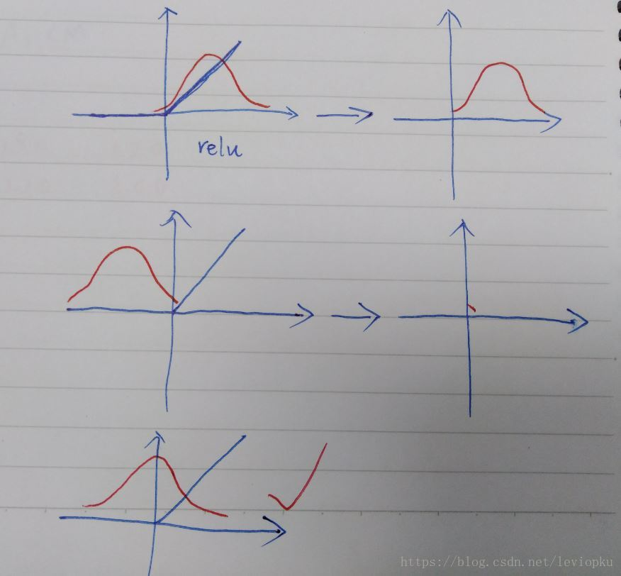
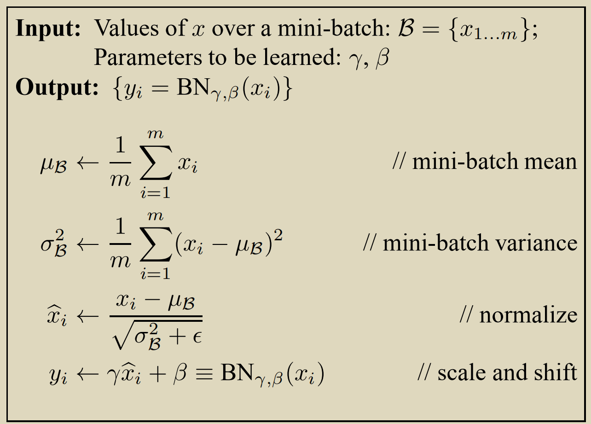
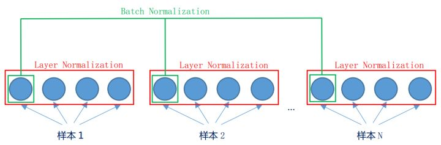

# Batch-Normalization和Layer-Normalization的简单区别

目录
=================

   * [Batch-Normalization和Layer-Normalization的简单区别](#batch-normalization和layer-normalization的简单区别)
      * [参考:](#参考)
      * [BN](#bn)
         * [BN的具体操作过程](#bn的具体操作过程)
         * [BN的归一化](#bn的归一化)
         * [BN的线性变换](#bn的线性变换)
         * [BN的优点](#bn的优点)
         * [BN的缺点](#bn的缺点)
      * [LN](#ln)
         * [LN的操作过程](#ln的操作过程)
         * [和BN对比](#和bn对比)

## 参考:
<a href="https://blog.csdn.net/leviopku/article/details/83109422" traget="_blank">【AI数学】Batch-Normalization详细解析</a>

<a href="https://blog.csdn.net/leviopku/article/details/83182194" traget="_blank">【AI数学】Layer-Normalization详细解析</a>

<a href="https://arxiv.org/abs/1607.06450v1" traget="_blank">Layer Normalization</a>

&emsp;&emsp;BN和LN都是处理数据的分布问题, 根据论文中的要求, 这种操作都必须在激活函数之前进行. 因为在经过卷积等一些操作之后, 数据的分布就变的不确定, 而不确定的数据分布传递给激活函数之后, 可能就无法得到有效的值, 对于下一层的数据计算就会产生一些影响. 例如引用别人博客的一张图:

&emsp;&emsp;可以看到, 上一层的输出结果,在没有经过归一化操作的时候, 数据的分布就具有不可预测性, 例如上面第一种, 比较容易造成过拟合, 第二种, 会导收敛变慢, 造成致训练速度过慢. 

&emsp;&emsp;如果这个时候, 可以把数据的分布进行一次归一化的缩放变换, 让数据的形式编程第三种情况, 就可以加快训练速度, 同时还有正则化的效果, 减少过拟合.

## BN

### BN的具体操作过程

1.首先是数据的输入, 我们可以看到输入的是一个完整的mini-batch, 这一个batch有m个数据

2,然后计算这一组数据的均值$\mu_{B}$和方差$\sigma_{B}$

3.之后对整个batch的数据进行归一化操作

4.之后在通过一个线性的缩放变换, 其中的$\gamma$和$\beta$是可学习的参数

### BN的归一化

&emsp;&emsp;这里的归一化实际上就是一个让数据符合标准正太分布的操作, 让数据的分布满足成一个期望为0, 方差为1. 然后这里的数据就会都集中到原点附近, 并且是关于y轴对称的.

### BN的线性变换

&emsp;&emsp;这里加上一个线性变换操作, 实际上是因为我们不知道标准的正太分布是不是就是最合适的情况, 所以我们通过设置参数$\gamma$和$\beta$是可学习, 让模型自己在提取数据特征的过程中确定最适合自己的分布, 例如是左右移动, 或者是让分布变瘦或者变胖, 变高或者是变矮.

### BN的优点

**1.加快收敛:** 因为让数据更好的通过激活函数, 减少梯度弥散. 同时可以不让模型去适应数据的分布, 减少迭代次数

**2.提高准确率:** 可能是更好让激活函数发挥了作用吧

### BN的缺点

**1.BN依赖于Batch Size的大小:** 从BN的优点也可以看出, BN是可以让模型不必去适应数据的分布, 那么这里其实相当于每次使用输入的Batch Size个数据来模拟全体数据的均值和方差, 毕竟是局部数据模拟出来的均值和方差, 那么和实际的肯定会有差距, 特别是Batch Size比较小的时候.

**2.BN不适用于处理序列化的网络(RNN):** 因为RNN这样的网络是一次输出部分结果, 同时数据的输入也比较不一致, 因为序列的长短很难一致, 这就导致BN无法应用在RNN中

**3.推导的时候无法使用BN:** 和第一条类似, 因为推导的时候, 输入的不一定是批量的

## LN

### LN的操作过程

&emsp;&emsp;LN的操作和BN的区别, 用下面的这张图表示比较明显

来自https://www.zhihu.com/question/48820040

&emsp;&emsp;LN相当于一次对一个数据进行求均值和方差, 例如一个batch size输入了32张图片, 那么这次LN就会计算出来32个均值和方差, 分别对应32张图片. 这样的话, LN就不会受到batch size值大小的影响, 同时也就不会受到序列长度不一致的影响, 也就可以应用在RNN中. 同时也可以应用在推导的过程中

### 和BN对比

&emsp;&emsp;根据博客所介绍的, 在Kaiming ECCV2018的paper里, 使用BN和LN进行了对比, 结果是在batch size值比较大的时候, BN的表现效果要强于LN. 但是LN的应用范围比BN更广也是LN的优点

