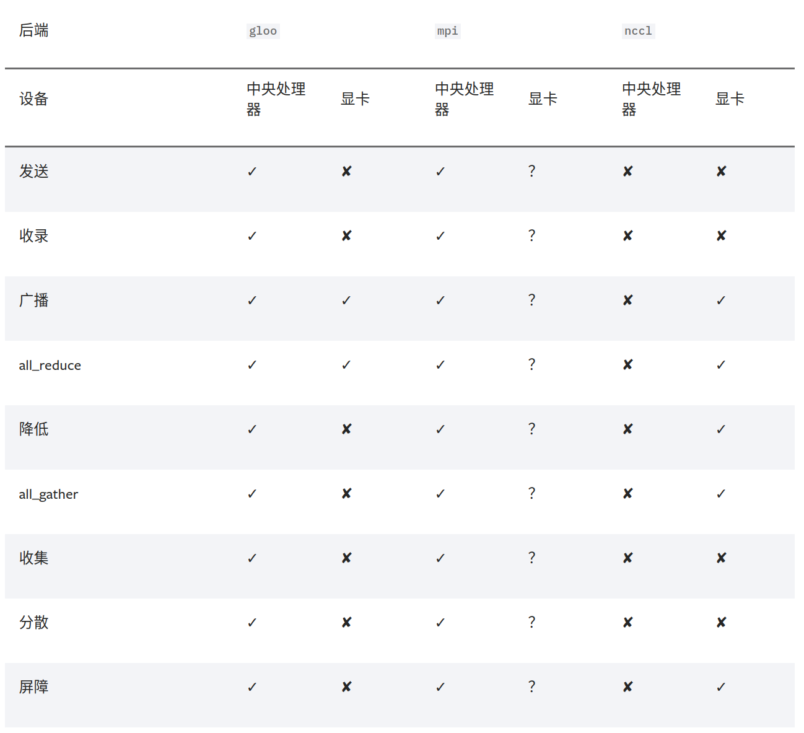

<!-- 目录
=================

   * [目录](#目录)
   * [pytorch多gpu并行训练](#pytorch多gpu并行训练)
      * [1.单机多卡并行训练](#1单机多卡并行训练)
         * [1.1.torch.nn.DataParallel](#11torchnndataparallel)
         * [1.2.如何平衡DataParallel带来的显存使用不平衡的问题](#12如何平衡dataparallel带来的显存使用不平衡的问题)
         * [1.3.torch.nn.parallel.DistributedDataParallel](#13torchnnparalleldistributeddataparallel)
      * [2.多机多gpu训练](#2多机多gpu训练)
         * [2.1.初始化](#21初始化)
            * [2.1.1.初始化backend](#211初始化backend)
            * [2.1.2.初始化init_method](#212初始化init_method)
               * [2.1.2.1.使用TCP初始化](#2121使用tcp初始化)
               * [2.1.2.2.使用共享文件系统初始化](#2122使用共享文件系统初始化)
            * [2.1.3.初始化rank和world_size](#213初始化rank和world_size)
            * [2.1.4.初始化中一些需要注意的地方](#214初始化中一些需要注意的地方)
         * [2.2.数据的处理-DataLoader](#22数据的处理-dataloader)
         * [2.3.模型的处理](#23模型的处理)
         * [2.4.模型的保存与加载](#24模型的保存与加载) -->

[TOC]

# 说明

参考链接：
<a href
='https://pytorch.org/docs/master/distributed.html#multi-gpu-collective-functions' traget="_blank">DISTRIBUTED COMMUNICATION PACKAGE - TORCH.DISTRIBUTED</a>

下面的教程是很久之前写的了，当时也忘记了当时使用的pytorch的版本号具体是多少了，估计是1.2或者1.0的。随着pytorch的版本逐渐更新迭代，到2021年9月的时候，目前已经迭代到1.9版本了，虽然torch.nn.DataParallel基本没有什么改变，但是torch.nn.parallel.DistributedDataParallel发生了一些改变，所以之后的关于torch.nn.parallel.DistributedDataParallel的使用方法发生了些许的改变，主要发生的改变如下：

## 1.和DataParallel的区别

虽然不太清楚DistributedDataParallel的具体实现，但是现在的DistributedDataParallel是基于多进程策略的多GPU训练方式。首先是单机多卡的方式上，针对每个GPU，启动一个进程，然后这些进程在最开始的时候会保持一致，同时在更新模型的时候，梯度传播也是完全一致的，这样就可以保证任何一个GPU上面的模型参数就是完全一致的，所以这样就不会出现DataParallel那样的显存不均衡的问题。

## 2.如何启动程序的时候

其次是启动程序的时候，DistributedDataParallel和以前的方法略有不同，我尝试直接在程序里面设置torch.distributed.init_process_group的相关参数，但是都无法成功的使用多GPU。所以我现在采用的启动方式是在运行代码的时候，在命令前面加上一些前缀：

### 2.1 单机多卡

```
python -m torch.distributed.launch --nproc_per_node=NUM_GPUS_YOU_HAVE main.py
nproc_per_node: 这个参数是指你使用这台服务器上面的几张显卡
```

### 2.2 多机多卡

假设你有两台服务器，那么咸在一台服务器上面启动一个进程：

```
python -m torch.distributed.launch --nproc_per_node=NUM_GPUS_YOU_HAVE
           --nnodes=2 --node_rank=0 --master_addr="192.168.1.1"
           --master_port=1234 main.py
```

之后在另外一台服务器上启动另外一个进程：

```
python -m torch.distributed.launch --nproc_per_node=NUM_GPUS_YOU_HAVE
           --nnodes=2 --node_rank=1 --master_addr="192.168.1.1"
           --master_port=1234 main.py
```

记得把master_addr换成你自己的ip。其次就是参数nnodes表示你要使用几台服务器，node_rank表示你目前使用的是哪个服务器，其实就相当于给服务器编号了。

### 2.3 代码里面的修改

虽然这里设置好了启动的相关命令，但是代码也需要进行修改，主要是加上下面的代码：

```
import argparse
parser = argparse.ArgumentParser()
parser.add_argument("--local_rank", type=int)
args = parser.parse_args()
```

这个local_rank参数，可以理解为就是torch.distributed.launch在给一个GPU创建进程的时候，给这个进程提供的GPU号，这个是自动给的，不需要手动指定。

之后就是在代码里面一定要写这句代码，而且这句代码要写在你所有和多GPU相关的代码前面，表明当前进程使用的GPU号，如果不写这句代码，所有的进程都默认的在你使用CUDA_VISIBLE_DEVICES参数设定的0号GPU上面启动。

```
torch.cuda.set_device(args.local_rank)  # before your code runs
```

### 2.4 简单的伪代码示例：

```
parser = argparse.ArgumentParser()
parser.add_argument("--local_rank", type=int)
args = parser.parse_args()

my_model = Model()

torch.cuda.set_device(opt.local_rank)
torch.distributed.init_process_group(backend='nccl')
my_model = my_model.cuda()  # 在使用DistributedDataParallel之前，需要先将模型放到GPU上
my_model = torch.nn.parallel.DistributedDataParallel(my_model, find_unused_parameters=True)

... ...
...
```

## 3.batch size的设置

因为DistributedDataParallel是在每个GPU上面起一个新的进程，所以这个时候设置的batch size实际上是指单个GPU上面的batch size大小。比如说，使用了2台服务器，每台服务器使用了8张GPU，然后batch size设置为了32，那么实际的batch size为32*8*2=512，所以实际的batch size并不是你设置的batch size。


# pytorch多gpu并行训练

*注: 以下都在Ubuntu上面进行的调试, 使用的Ubuntu版本包括14, 18LST*

参考文档:

<a href
='https://pytorch.org/tutorials/beginner/blitz/data_parallel_tutorial.html' traget="_blank">data_parallel_tutorial</a>

<a href="https://pytorch.org/docs/stable/nn.html#distributeddataparallel" traget="_blank">distributeddataparallel</a>

<a href="https://pytorch.org/docs/stable/distributed.html#environment-variable-initialization" traget="_blank">environment-variable-initialization</a>

<a href="https://pytorch.org/tutorials/beginner/aws_distributed_training_tutorial.html?highlight=distributedsampler" traget="_blank">PYTORCH 1.0 DISTRIBUTED TRAINER WITH AMAZON AWS</a>

<a href="https://github.com/pytorch/examples/blob/master/imagenet/main.py" traget="_blank">pytorch/examples/imagenet/main.py</a>

<a href="https://github.com/edwhere/Distributed-VGG-F" traget="_blank">Distributed-VGG-F</a>

<a href="https://pytorch.org/tutorials/intermediate/ddp_tutorial.html" traget="_blank">Getting Started with Distributed Data Parallel</a>

## 1.单机多卡并行训练

### 1.1.torch.nn.DataParallel

&emsp;&emsp;我一般在使用多GPU的时候, 会喜欢使用`os.environ['CUDA_VISIBLE_DEVICES']`来限制使用的GPU个数, 例如我要使用第0和第3编号的GPU, 那么只需要在程序中设置:

```
os.environ['CUDA_VISIBLE_DEVICES'] = '0,3'
```

&emsp;&emsp;但是要注意的是, 这个参数的设定要保证在模型加载到gpu上之前, 我一般都是在程序开始的时候就设定好这个参数, 之后如何将模型加载到多GPU上面呢?

&emsp;&emsp;如果是模型, 那么需要执行下面的这几句代码:

```
model = nn.DataParallel(model)
model = model.cuda()
```

&emsp;&emsp;如果是数据, 那么直接执行下面这几句代码就可以了:

```
inputs = inputs.cuda()
labels = labels.cuda()
```

&emsp;&emsp;其实如果看pytorch<a href
='https://pytorch.org/tutorials/beginner/blitz/data_parallel_tutorial.html' traget="_blank">官网</a>给的示例代码,我们可以看到下面这样的代码

```
model = Model(input_size, output_size)
if torch.cuda.device_count() > 1:
    print("Let's use", torch.cuda.device_count(), "GPUs!")
    # dim = 0 [30, xxx] -> [10, ...], [10, ...], [10, ...] on 3 GPUs
    model = nn.DataParallel(model)

model.to(device)
```

&emsp;&emsp;这个和我上面写的好像有点不太一样, 但是如果看一下`DataParallel`的内部代码, 我们就可以发现, 其实是一样的:

```
class DataParallel(Module):
    def __init__(self, module, device_ids=None, output_device=None, dim=0):
        super(DataParallel, self).__init__()

        if not torch.cuda.is_available():
            self.module = module
            self.device_ids = []
            return

        if device_ids is None:
            device_ids = list(range(torch.cuda.device_count()))
        if output_device is None:
            output_device = device_ids[0]
```

&emsp;&emsp;我截取了其中一部分代码, 我们可以看到如果我们不设定好要使用的`device_ids的`话, 程序会自动找到这个机器上面可以用的所有的显卡, 然后用于训练. 但是因为我们前面使用`os.environ['CUDA_VISIBLE_DEVICES']`限定了这个程序可以使用的显卡, 所以这个地方程序如果自己获取的话, 获取到的其实就是我们上面设定的那几个显卡.

&emsp;&emsp;我没有进行深入得到考究, 但是我感觉使用`os.environ['CUDA_VISIBLE_DEVICES']`对可以使用的显卡进行限定之后, 显卡的实际编号和程序看到的编号应该是不一样的, 例如上面我们设定的是`os.environ['CUDA_VISIBLE_DEVICES']="0,2"`, 但是程序看到的显卡编号应该被改成了```'0,1'```, 也就是说程序所使用的显卡编号实际上是经过了一次映射之后才会映射到真正的显卡编号上面的, 例如这里的程序看到的1对应实际的2

### 1.2.如何平衡DataParallel带来的显存使用不平衡的问题

&emsp;&emsp;这个问题其实讨论的也比较多了, 官方给的解决方案就是使用 `DistributedDataParallel`来代替 `DataParallel`(实际上`DistributedDataParallel`显存分配的也不是很平衡), 但是从某些角度来说, `DataParallel`使用起来确实比较方便, 而且最近使用 `DistributedDataParallel` 遇到一些小问题. 所以这里提供一个解决显存使用不平衡问题的方案:

&emsp;&emsp;首先这次的解决方案来自transformer-XL的官方代码: https://github.com/kimiyoung/transformer-xl

&emsp;&emsp;然后我将其中的平衡GPU显存的代码提取了出来放到了github上面:https://github.com/Link-Li/Balanced-DataParallel

&emsp;&emsp;这里的代码是原作者继承了 `DataParallel` 类之后进行了改写:

```
class BalancedDataParallel(DataParallel):
    def __init__(self, gpu0_bsz, *args, **kwargs):
        self.gpu0_bsz = gpu0_bsz
        super().__init__(*args, **kwargs)
    ...
```

&emsp;&emsp;这个 `BalancedDataParallel` 类使用起来和 `DataParallel` 类似, 下面是一个示例代码:

```
my_net = MyNet()
my_net = BalancedDataParallel(gpu0_bsz // acc_grad, my_net, dim=0).cuda()
```

&emsp;&emsp;这里包含三个参数, 第一个参数是第一个GPU要分配多大的batch_size, 但是要注意, 如果你使用了梯度累积, 那么这里传入的是每次进行运算的实际batch_size大小. 举个例子, 比如你在3个GPU上面跑代码, 但是一个GPU最大只能跑3条数据, 但是因为0号GPU还要做一些数据的整合操作, 于是0号GPU只能跑2条数据, 这样一算, 你可以跑的大小是2+3+3=8, 于是你可以设置下面的这样的参数:

```
batch_szie = 8
gpu0_bsz = 2
acc_grad = 1
my_net = MyNet()
my_net = BalancedDataParallel(gpu0_bsz // acc_grad, my_net, dim=0).cuda()
```

&emsp;&emsp;这个时候突然想跑个batch size是16的怎么办呢, 那就是4+6+6=16了, 这样设置累积梯度为2就行了:


```
batch_szie = 16
gpu0_bsz = 4
acc_grad = 2
my_net = MyNet()
my_net = BalancedDataParallel(gpu0_bsz // acc_grad, my_net, dim=0).cuda()
```

### 1.3.torch.nn.parallel.DistributedDataParallel

&emsp;&emsp;pytorch的官网建议使用`DistributedDataParallel`来代替`DataParallel`, 据说是因为`DistributedDataParallel`比`DataParallel`运行的更快, 然后显存分屏的更加均衡. 而且`DistributedDataParallel`功能更加强悍, 例如分布式的模型(一个模型太大, 以至于无法放到一个GPU上运行, 需要分开到多个GPU上面执行). 只有`DistributedDataParallel`支持分布式的模型像单机模型那样可以进行多机多卡的运算.当然具体的怎么个情况, 建议看官方文档. 

&emsp;&emsp;依旧是先设定好`os.environ['CUDA_VISIBLE_DEVICES']`, 然后再进行下面的步骤.

&emsp;&emsp;因为`DistributedDataParallel`是支持多机多卡的, 所以这个需要先初始化一下, 如下面的代码:

```
torch.distributed.init_process_group(backend='nccl', init_method='tcp://localhost:23456', rank=0, world_size=1)
```

&emsp;&emsp;第一个参数是pytorch支持的通讯后端, 后面会继续介绍, 但是这里单机多卡, 这个就是走走过场. 第二个参数是各个机器之间通讯的方式, 后面会介绍, 这里是单机多卡, 设置成localhost就行了, 后面的端口自己找一个空着没用的就行了. rank是标识主机和从机的, 这里就一个主机, 设置成0就行了. world_size是标识使用几个主机, 这里就一个主机, 设置成1就行了, 设置多了代码不允许.

&emsp;&emsp;其实如果是使用单机多卡的情况下, 根据pytorch的官方代码<a href="https://pytorch.org/docs/stable/nn.html#distributeddataparallel" traget="_blank">distributeddataparallel</a>, 是直接可以使用下面的代码的:

```
torch.distributed.init_process_group(backend="nccl")
model = DistributedDataParallel(model) # device_ids will include all GPU devices by default
```

&emsp;&emsp;但是这里需要注意的是, 如果使用这句代码, 直接在pycharm或者别的编辑器中,是没法正常运行的, 因为这个需要在shell的命令行中运行, 如果想要正确执行这段代码, 假设这段代码的名字是`main.py`, 可以使用如下的方法进行(<a href="https://github.com/NVIDIA/apex/issues/393" traget="_blank">参考1</a> <a href="https://github.com/NVIDIA/apex/issues/99" traget="_blank">参考2</a>):

```
python -m torch.distributed.launch main.py 
```
*注: 这里如果使用了argparse, 一定要在参数里面加上`--local_rank`, 否则运行还是会出错的*


&emsp;&emsp;之后就和使用`DataParallel`很类似了.

```
model = model.cuda()
model = nn.parallel.DistributedDataParallel(model)
```

&emsp;&emsp;但是注意这里要先将`model`加载到GPU, 然后才能使用`DistributedDataParallel`进行分发, 之后的使用和`DataParallel`就基本一样了


## 2.多机多gpu训练

***在单机多gpu可以满足的情况下, 绝对不建议使用多机多gpu进行训练, 我经过测试, 发现多台机器之间传输数据的时间非常慢, 主要是因为我测试的机器可能只是千兆网卡, 再加上别的一些损耗, 网络的传输速度跟不上, 导致训练速度实际很慢. 我看一个github上面的人说在单机8显卡可以满足的情况下, 最好不要进行多机多卡训练***

建议看这两份代码, 实际运行一下, 才会真的理解怎么使用

<a href="https://github.com/pytorch/examples/blob/master/imagenet/main.py" traget="_blank">pytorch/examples/imagenet/main.py</a>

<a href="https://github.com/edwhere/Distributed-VGG-F" traget="_blank">Distributed-VGG-F</a>

### 2.1.初始化

*初始化操作一般在程序刚开始的时候进行*

&emsp;&emsp;在进行多机多gpu进行训练的时候, 需要先使用`torch.distributed.init_process_group()`进行初始化. `torch.distributed.init_process_group()`包含四个常用的参数

```
backend: 后端, 实际上是多个机器之间交换数据的协议
init_method: 机器之间交换数据, 需要指定一个主节点, 而这个参数就是指定主节点的
world_size: 介绍都是说是进程, 实际就是机器的个数, 例如两台机器一起训练的话, world_size就设置为2
rank: 区分主节点和从节点的, 主节点为0, 剩余的为了1-(N-1), N为要使用的机器的数量, 也就是world_size
```

#### 2.1.1.初始化`backend`

&emsp;&emsp;首先要初始化的是`backend`, 也就是俗称的后端, 在pytorch的官方教程中提供了以下这些<a href="https://pytorch.org/docs/stable/distributed.html#backends" traget="_blank">后端</a>



&emsp;&emsp;根据官网的介绍, 如果是使用cpu的分布式计算, 建议使用`gloo`, 因为表中可以看到
`gloo`对cpu的支持是最好的, 然后如果使用gpu进行分布式计算, 建议使用`nccl`, 实际测试中我也感觉到, 当使用gpu的时候, `nccl`的效率是高于`gloo`的. 根据博客和官网的态度, 好像都不怎么推荐在多gpu的时候使用`mpi`

&emsp;&emsp;对于后端选择好了之后, 我们需要设置一下网络接口, 因为多个主机之间肯定是使用网络进行交换, 那肯定就涉及到ip之类的, 对于`nccl`和`gloo`一般会自己寻找网络接口, 但是某些时候, 比如我测试用的服务器, 不知道是系统有点古老, 还是网卡比较多, 需要自己手动设置. 设置的方法也比较简单, 在Python的代码中, 使用下面的代码进行设置就行:

```
import os
# 以下二选一, 第一个是使用gloo后端需要设置的, 第二个是使用nccl需要设置的
os.environ['GLOO_SOCKET_IFNAME'] = 'eth0'
os.environ['NCCL_SOCKET_IFNAME'] = 'eth0'
```

&emsp;&emsp;我们怎么知道自己的网络接口呢, 打开命令行, 然后输入`ifconfig`, 然后找到那个带自己ip地址的就是了, 我见过的一般就是`em0`, `eth0`, `esp2s0`之类的, 当然具体的根据你自己的填写. 如果没装`ifconfig`, 输入命令会报错, 但是根据报错提示安装一个就行了.

#### 2.1.2.初始化`init_method`

&emsp;&emsp;初始化`init_method`的方法有两种, 一种是使用TCP进行初始化, 另外一种是使用共享文件系统进行初始化

##### 2.1.2.1.使用TCP初始化

&emsp;&emsp;看代码:

```
import torch.distributed as dist

dist.init_process_group(backend, init_method='tcp://10.1.1.20:23456',
                        rank=rank, world_size=world_size)
```

&emsp;&emsp;注意这里使用格式为`tcp://ip:端口号`, 首先`ip`地址是你的主节点的ip地址, 也就是`rank`参数为0的那个主机的ip地址, 然后再选择一个空闲的端口号, 这样就可以初始化`init_method`了.

##### 2.1.2.2.使用共享文件系统初始化

&emsp;&emsp;好像看到有些人并不推荐这种方法, 因为这个方法好像比TCP初始化要没法, 搞不好和你硬盘的格式还有关系, 特别是window的硬盘格式和Ubuntu的还不一样, 我没有测试这个方法, 看代码:

```
import torch.distributed as dist

dist.init_process_group(backend, init_method='file:///mnt/nfs/sharedfile',
                        rank=rank, world_size=world_size)
```

&emsp;&emsp;根据官网介绍, 要注意提供的共享文件一开始应该是不存在的, 但是这个方法又不会在自己执行结束删除文件, 所以下次再进行初始化的时候, 需要手动删除上次的文件, 所以比较麻烦, 而且官网给了一堆警告, 再次说明了这个方法不如TCP初始化的简单.

#### 2.1.3.初始化`rank`和`world_size`

&emsp;&emsp;这里其实没有多难, 你需要确保, 不同机器的`rank`值不同, 但是主机的`rank`必须为0, 而且使用`init_method`的ip一定是`rank`为0的主机, 其次`world_size`是你的主机数量, 你不能随便设置这个数值, 你的参与训练的主机数量达不到`world_size`的设置值时, 代码是不会执行的.

#### 2.1.4.初始化中一些需要注意的地方

&emsp;&emsp;首先是代码的统一性, 所有的节点上面的代码, 建议完全一样, 不然有可能会出现一些问题, 其次, 这些初始化的参数强烈建议通过`argparse`模块(命令行参数的形式)输入, 不建议写死在代码中, 也不建议使用pycharm之类的IDE进行代码的运行, 强烈建议使用命令行直接运行.

&emsp;&emsp;其次是运行代码的命令方面的问题, 例如使用下面的命令运行代码`distributed.py`:

```
python distributed.py -bk nccl -im tcp://10.10.10.1:12345 -rn 0 -ws 2 
```

&emsp;&emsp;上面的代码是在主节点上运行, 所以设置`rank`为0, 同时设置了使用两个主机, 在从节点运行的时候, 输入的代码是下面这样:

```
python distributed.py -bk nccl -im tcp://10.10.10.1:12345 -rn 1 -ws 2 
```

&emsp;&emsp;一定要注意的是, 只能修改`rank`的值, 其他的值一律不得修改, 否则程序就卡死了初始化到这里也就结束了.

### 2.2.数据的处理-DataLoader

&emsp;&emsp;其实数据的处理和正常的代码的数据处理非常类似, 但是因为多机多卡涉及到了效率问题, 所以这里才会使用`torch.utils.data.distributed.DistributedSampler`来规避数据传输的问题. 首先看下面的代码:

```
print("Initialize Dataloaders...")
# Define the transform for the data. Notice, we must resize to 224x224 with this dataset and model.
transform = transforms.Compose(
    [transforms.Resize(224),
     transforms.ToTensor(),
     transforms.Normalize((0.5, 0.5, 0.5), (0.5, 0.5, 0.5))])

# Initialize Datasets. STL10 will automatically download if not present
trainset = datasets.STL10(root='./data', split='train', download=True, transform=transform)
valset = datasets.STL10(root='./data', split='test', download=True, transform=transform)

# Create DistributedSampler to handle distributing the dataset across nodes when training
# This can only be called after torch.distributed.init_process_group is called
# 这一句就是和平时使用有点不一样的地方
train_sampler = torch.utils.data.distributed.DistributedSampler(trainset)

# Create the Dataloaders to feed data to the training and validation steps
train_loader = torch.utils.data.DataLoader(trainset, batch_size=batch_size, shuffle=(train_sampler is None), num_workers=workers, pin_memory=False, sampler=train_sampler)
val_loader = torch.utils.data.DataLoader(valset, batch_size=batch_size, shuffle=False, num_workers=workers, pin_memory=False)
```

&emsp;&emsp;其实单独看这段代码, 和平时写的很类似, 唯一不一样的其实就是这里先将`trainset`送到了`DistributedSampler`中创造了一个`train_sampler`, 然后在构造`train_loader`的时候, 参数中传入了一个`sampler=train_sampler`. 使用这些的意图是, 让不同节点的机器加载自己本地的数据进行训练, 也就是说进行多机多卡训练的时候, 不再是从主节点分发数据到各个从节点, 而是各个从节点自己从自己的硬盘上读取数据.

&emsp;&emsp;当然了, 如果直接让各个节点自己读取自己的数据, 特别是在训练的时候经常是要打乱数据集进行训练的, 这样就会导致不同的节点加载的数据混乱, 所以这个时候使用`DistributedSampler`来创造一个`sampler`提供给`DataLoader`, `sampler`的作用自定义一个数据的编号, 然后让`DataLoader`按照这个编号来提取数据放入到模型中训练, 其中`sampler`参数和`shuffle`参数不能同时指定, 如果这个时候还想要可以随机的输入数据, 我们可以在`DistributedSampler`中指定`shuffle`参数, 具体的可以参考官网的<a href="https://pytorch.org/docs/stable/data.html#" traget="_blank">api</a>, 拉到最后就是`DistributedSampler`

### 2.3.模型的处理

&emsp;&emsp;模型的处理其实和上面的单机多卡没有多大区别, 还是下面的代码, 但是注意要提前想把模型加载到gpu, 然后才可以加载到`DistributedDataParallel`

```
model = model.cuda()
model = nn.parallel.DistributedDataParallel(model)
```
### 2.4.模型的保存与加载

&emsp;&emsp;这里引用<a href="https://pytorch.org/tutorials/intermediate/ddp_tutorial.html" traget="_blank">pytorch官方教程</a>的一段代码:

```
def demo_checkpoint(rank, world_size):
    setup(rank, world_size)

    # setup devices for this process, rank 1 uses GPUs [0, 1, 2, 3] and
    # rank 2 uses GPUs [4, 5, 6, 7].
    n = torch.cuda.device_count() // world_size
    device_ids = list(range(rank * n, (rank + 1) * n))

    model = ToyModel().to(device_ids[0])
    # output_device defaults to device_ids[0]
    ddp_model = DDP(model, device_ids=device_ids)

    loss_fn = nn.MSELoss()
    optimizer = optim.SGD(ddp_model.parameters(), lr=0.001)

    CHECKPOINT_PATH = tempfile.gettempdir() + "/model.checkpoint"
    if rank == 0:
        # All processes should see same parameters as they all start from same
        # random parameters and gradients are synchronized in backward passes.
        # Therefore, saving it in one process is sufficient.
        torch.save(ddp_model.state_dict(), CHECKPOINT_PATH)

    # Use a barrier() to make sure that process 1 loads the model after process
    # 0 saves it.
    dist.barrier()
    # configure map_location properly
    rank0_devices = [x - rank * len(device_ids) for x in device_ids]
    device_pairs = zip(rank0_devices, device_ids)
    map_location = {'cuda:%d' % x: 'cuda:%d' % y for x, y in device_pairs}
    ddp_model.load_state_dict(
        torch.load(CHECKPOINT_PATH, map_location=map_location))

    optimizer.zero_grad()
    outputs = ddp_model(torch.randn(20, 10))
    labels = torch.randn(20, 5).to(device_ids[0])
    loss_fn = nn.MSELoss()
    loss_fn(outputs, labels).backward()
    optimizer.step()

    # Use a barrier() to make sure that all processes have finished reading the
    # checkpoint
    dist.barrier()

    if rank == 0:
        os.remove(CHECKPOINT_PATH)

    cleanup()
```

&emsp;&emsp;我并没有实际操作, 因为多卡多GPU代码运行起来实在是难受, 一次实验可能就得好几分钟, 要是搞错一点可能就得好几十分钟都跑不起来, 最主要的是还要等能用的GPU. 不过看上面的代码, 最重要的实际是这句 `dist.barrier()`, 这个是来自`torch.distributed.barrier()`, 根据pytorch的官网的介绍, 这个函数的功能是同步所有的进程, 直到整组(也就是所有节点的所有GPU)到达这个函数的时候, 才会执行后面的代码, 看上面的代码, 可以看到, 在保存模型的时候, 是只找`rank`为0的点保存模型, 然后在加载模型的时候, 首先得让所有的节点同步一下, 然后给所有的节点加载上模型, 然后在进行下一步的时候, 还要同步一下, 保证所有的节点都读完了模型. 虽然我不清楚这样做的意义是什么, 但是官网说不这样做会导致一些问题, 我并没有实际操作, 不发表意见.

&emsp;&emsp;至于保存模型的时候, 是保存哪些节点上面的模型, pytorch推荐的是`rank=0`的节点, 然后我看在论坛上, 有人也会保存所有节点的模型, 然后进行计算, 至于保存哪些, 我并没有做实验, 所以并不清楚到底哪种最好.


