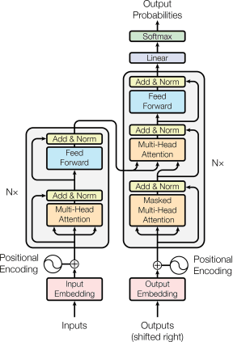
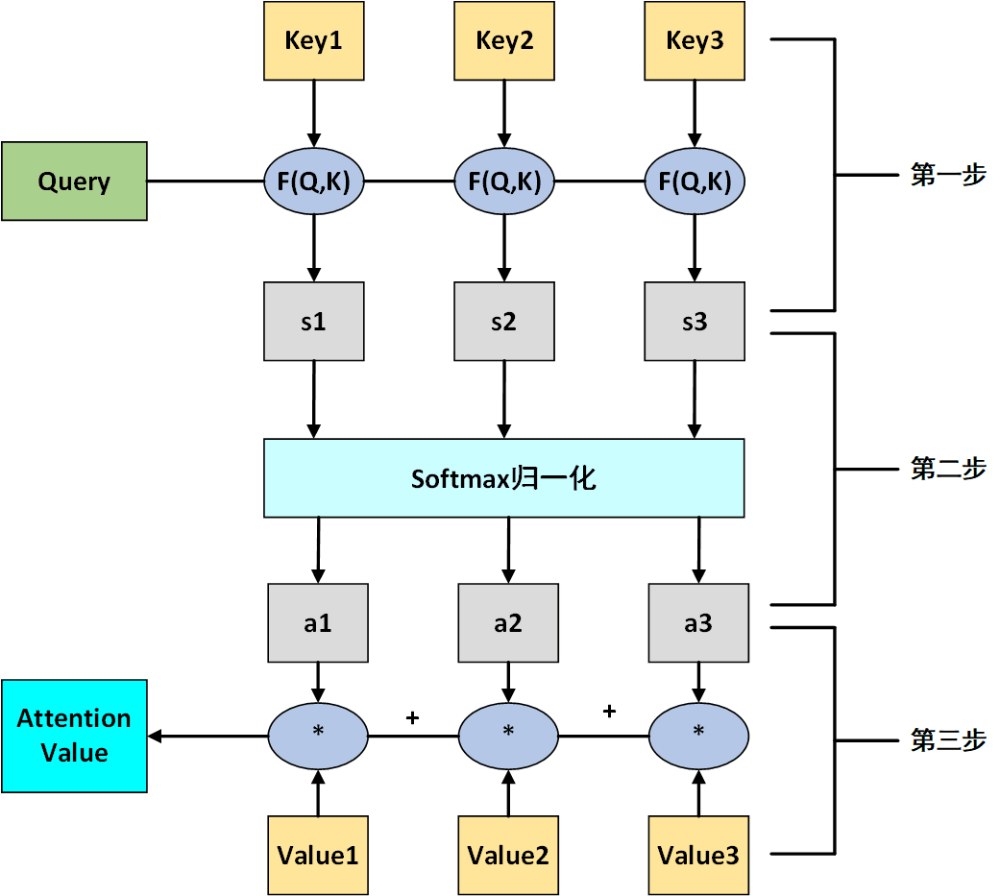
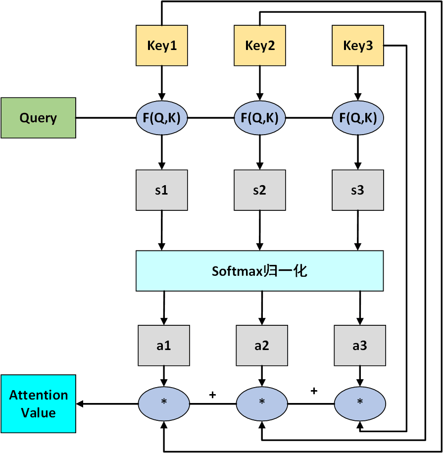

@[TOC](Attention)

# Transformer

## Transformer总体图

Figure 1. Lena

**本文主要参考了以下链接**

<a href="http://jalammar.github.io/illustrated-transformer/" target="_blank">http://jalammar.github.io/illustrated-transformer/</a> 

<a href="https://arxiv.org/abs/1706.03762" target="_blank">Attention is All You Need</a>

本文图片几乎都来自上面的链接,如有侵权,请联系删除

## 简单attention

&emsp;&emsp;常用的attention计算法方法, 是描述成一个查询(query)和键值对(key-value)的形式, 如下图所示

&emsp;&emsp;主要分3步, 第一步将$Query$和$Key$进行相乘然后得到初步的权重, 常用的$F(Q,K)$函数有

$$
F(Q,K) = 
\left
\{
\begin{aligned}
 & Q^TK_i & & dot \\  
 & Q^TW_{\alpha}K_i & & general \\ 
 & W_{\alpha}[Q;K_i] & & concat \\ 
 & v_{\alpha}^Ttanh(W_{\alpha}Q+U_{\alpha}K_i) & & perceptron 
\end{aligned}
\right.
$$

然后第二步使用$Softmax$进行归一化处理, 得到了每个value对应的权重值. 最后第三部$Value$和对应的权重值相乘, 最后将结果相加, 得到最终的$Attention \ \  Value$.

&emsp;&emsp;但是在实际情况中, 经常是$Key$和$Value$是一样的, 也就是下面的这样:

## Self-Attention

&emsp;&emsp;Self-Attention只是Transformer中一个基本单位, 其中的多头Attention其实就是由Self-Attention组成的. 在Transformer中, 每个多头Attention就是由8个Self-Attention组成的, 也就是因为这样的存在,所以可以进行并行的运算. 下面就具体说一下Self-Attention

### Q、K和V的获取

&emsp;&emsp;和以前的Attention是一样的, Self-Attention也是需要Q、K和V的. 论文中的Self-Attention其实有三种方式获得Q、K和V. 分别是:

- 在编码层中, Self-Attention的Q、K和V是由输入的词向量得到的.
- 在解码层的Masked Multi-Head Attention中, 这里的Self-Attention的Q、K和V是由输出结果的词向量得到的
- 在Encoder-Decoder连接的那个Multi-Head Attention中, K和V来自Encoder的输出结果, 而Q来自于Decoder层的第一层子单元的输出结果

&emsp;&emsp;我们这里先按第一种方式来讲, 因为都是差不多的

&emsp;&emsp;从上图中可以看到, 使用$W^Q、W^K、W^V$对输入的词向量$X_1, ..., X_n$做矩阵乘法, 然后得到我们需要的$Q、K、V$.

&emsp;&emsp;上面就是Self-Attention的运算过程了. 例如在我们得到了Thinking的$Q、K、V$之后, 我们需要做的就是让$q_1$和$k_1, k_2$做矩阵乘法,然后得到Thinking的$Q$对于所有$K$的得分. 然后让这些得分除以8, 这里的8是因为论文中的K的维度是1*64, 而$\sqrt{64} = 8$. 论文说这里是为了梯度稳定. 然后再通过Softmax, 就可以得到每个$V$的最终比例. 这里将所有的$V$和对应的得分进行相乘, 然后相加, 就得到了Thinking的得分$z_1$. 之后通过相同的办法,让Machines的$Q,K,V$也经过步骤, 然后得到Machines的最终结果$z_2$.

&emsp;&emsp;其实从图中可以看到, 某个单词$w$的Softmax的最终得分, 决定了这个单词$w$的关注点是哪个单词, 但是同时, 最后的求和操作, 也让这个单词对其他的词有了一定的关注度, 但是这个关注度比较少, 但是应该是可以维持句子中每个单词之间的关系.

### Multi-Head

&emsp;&emsp;上面的其实只是多头Attention的其中一个"头". 在原论文中, 编码器这头其实有8个这样的"头", 什么意思呢, 其实可以看下图:

&emsp;&emsp;这里举出了两个"头", 其实就是我们在进行Self-Attention的时候, 我们是并行进行的, 也就是说同时会有8个这样的Self-Attention在计算. 根据我看的资料, 据说这样可以让句子中的一些单词有多个可以注意的对象. 例如$I \ like \ watching \ TV \ and \ Playing \ games$, 这里的$I$的关注对象其实有两个, 一个是$TV$, 一个是$games$. 如果只使用一个"头"的话, 可能导致这里的$I$对这两个的关注不够, 但是使用多个"头"就可以避免这样的情况 

## 编码层Encoder

### Feed Forward操作

&emsp;&emsp;从某些角度来说, 其实上面的就是全部的Self-Attention的内容了. 但是在连接线性层的时候, 因为我们发现Mutil-Head Attention的输出实际是8个, 这样的话就没法经过线性连接层了. 原论文中, 他们是直接把每个Self-Attention输出的结果$z$直接拼接起来, 然后通过一个$W^O$, 压缩成一个和$z$维度相同的向量, 入下图所示:

&emsp;&emsp;然后将这个矩阵再送入到线性连接层就可以了. 原论文中, 线性连接层, 使用了两层线性层, 并使用激活函数ReLu, 公式如下:

$$
FFN(x) = max(0, xW_1+b_1)W_2+b_2
$$

&emsp;&emsp;线性层中的输入输出都是512维的向量, 但是中间隐藏层是2048维的

### Add & Norm 操作

&emsp;&emsp;在Transformer中, 每个单元中的每个子层结束之后, 都会有一个类似的残差操作和一个归一化操作, 公式如下

$$
LayerNorm(x + Sublayer(x))
$$

这里应该就是类似残差, 因为每次的计算, 都不可避免的会丢失一些信息, 这些信息或许在这一层的没有发挥它的作用, 但是很难说会不会在之后发挥作用.

### Positional Encoding

&emsp;&emsp;这里是因为在Transformer中, 并没有哪些操作是可以区分序列的顺序的, 不像RNN那样天然的就可以区分序列的顺序, 所以这里需要一个操作, 让输入的序列有顺序性. 这里原论文使用的是使用$sin()$和$cos()$函数生成一个序列, 这个序列就是Positional Encodeing, 然后把这个序列加到原来的词向量中, 这样这个序列就带有来了顺序性, 具体的原因还不是特别的清楚, 可以参考一下这个回答<a href="https://zhuanlan.zhihu.com/p/44731789" target="_blank">https://zhuanlan.zhihu.com/p/44731789</a>. 这里阐述了怎么加Positional Encoding. 不过这个回答似乎使用了另外一种多头Attention的方式, 具体的回来再继续研究

## 解码层Decoder

&emsp;&emsp;解码层和编码层其实很类似, 首先给出一个整体的运行过程的图

### Masked
&emsp;&emsp;这里要记录一下Masked Muitl-Head Attention, 这里的Masked操作实际上是为了防止在解码的时候, 看到后面的内容. 根据师兄的解释, 这里主要是在训练的过程中, 上面的那个动图, 其实显示的是预测过程中的情况, 而实际在训练的时候, 在解码层这边, 例如上面输出的结果应该是$ I \ am \ a \ student$, 那么在训练的时候, 我们会直接把这句话送到解码层的输入端, 但是我们为了模拟实际情况下的输入, 我们在每次解码端输入的词是有限制的, 例如限制解码端已经输出了两个词, 那么下次解码端输入的其实是$I \ am$这两个词, 并没有输入之后的内容进去. 但是论文中, 作者是在计算出来了$Q*K$的值之后才进行的Masked操作, 具体是什么的样子的, 留着之后再继续研究.

