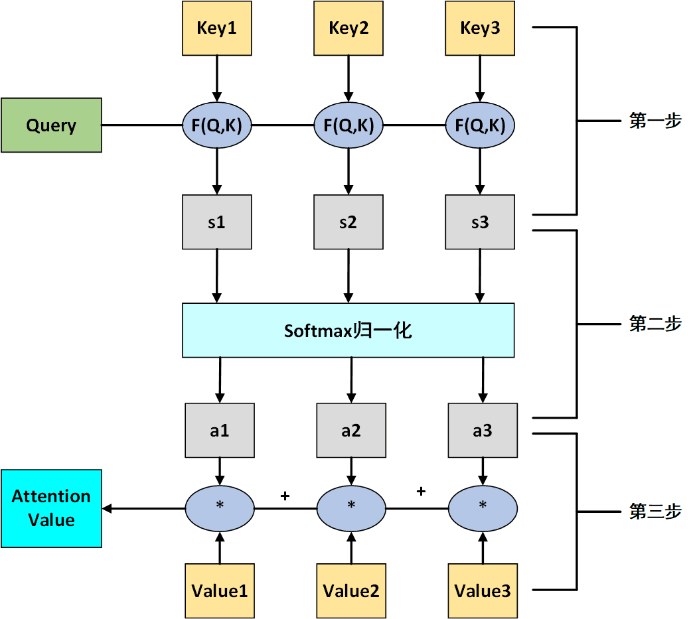
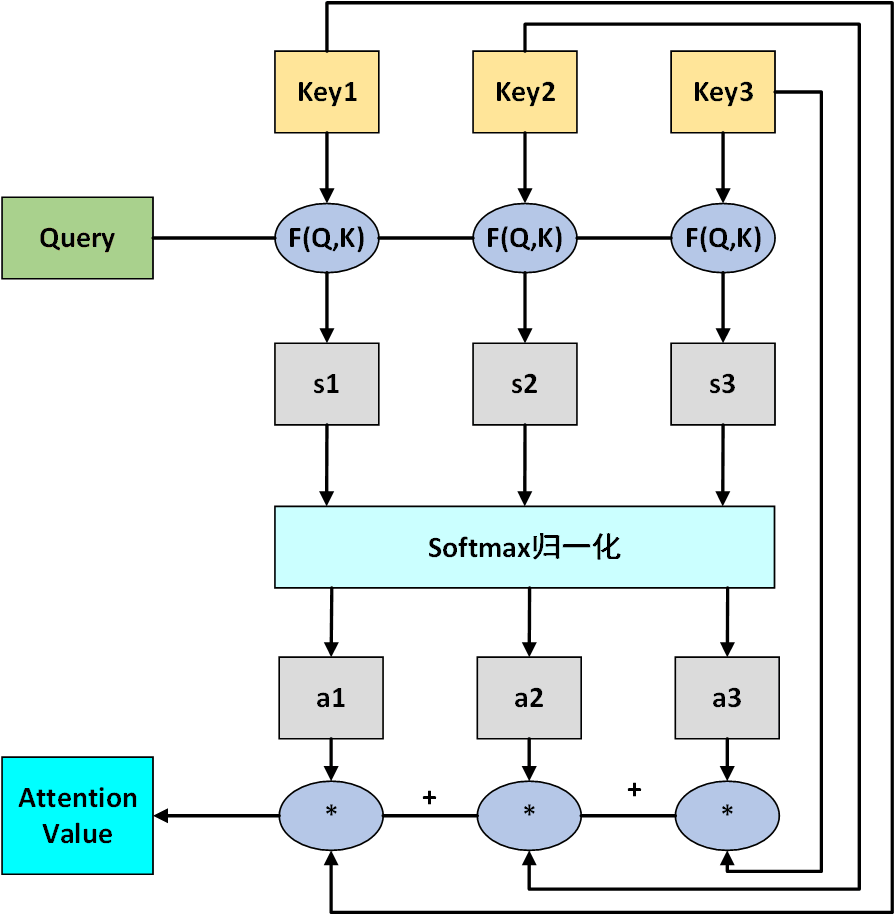

@[TOC](Attention)

# Transformer

## Transformer总体图

Figure 1. Lena

## 简单attention

&emsp;&emsp;常用的attention计算法方法, 是描述成一个查询(query)和键值对(key-value)的形式, 如下图所示

&emsp;&emsp;主要分3步, 第一步将$Query$和$Key$进行相乘然后得到初步的权重, 常用的$F(Q,K)$函数有

$$
F(Q,K) = 
\left
\{
\begin{aligned}
 & Q^TK_i & & dot \\  
 & Q^TW_{\alpha}K_i & & general \\ 
 & W_{\alpha}[Q;K_i] & & concat \\ 
 & v_{\alpha}^Ttanh(W_{\alpha}Q+U_{\alpha}K_i) & & perceptron 
\end{aligned}
\right.
$$

然后第二步使用$Softmax$进行归一化处理, 得到了每个value对应的权重值. 最后第三部$Value$和对应的权重值相乘, 最后将结果相加, 得到最终的$Attention \ \  Value$.

&emsp;&emsp;但是在实际情况中, 经常是$Key$和$Value$是一样的, 也就是下面的这样:

## Self-Attention

&emsp;&emsp;Self-Attention只是Transformer中一个基本单位, 其中的多头Attention其实就是由Self-Attention组成的. 在Transformer中, 每个多头Attention就是由8个Self-Attention组成的, 也就是因为这样的存在,所以可以进行并行的运算. 下面就具体说一下Self-Attention

### Q、K和V的获取

&emsp;&emsp;和以前的Attention是一样的, Self-Attention也是需要Q、K和V的. 论文中的Self-Attention其实有三种方式获得Q、K和V. 分别是:

- 在编码层中, Self-Attention的Q、K和V是由输入的词向量得到的.
- 在解码层的Masked Multi-Head Attention中, 这里的Self-Attention的Q、K和V是由输出结果的词向量得到的
- 在Encoder-Decoder连接的那个Multi-Head Attention中, K

## 编码层Encoder

## 解码层Decoder

