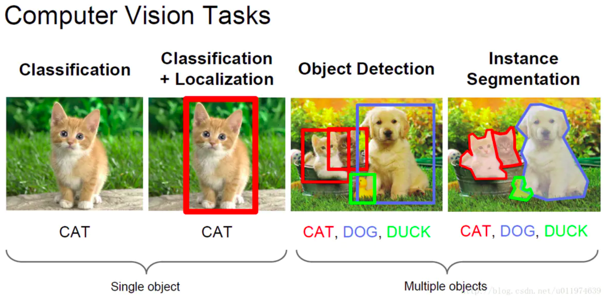
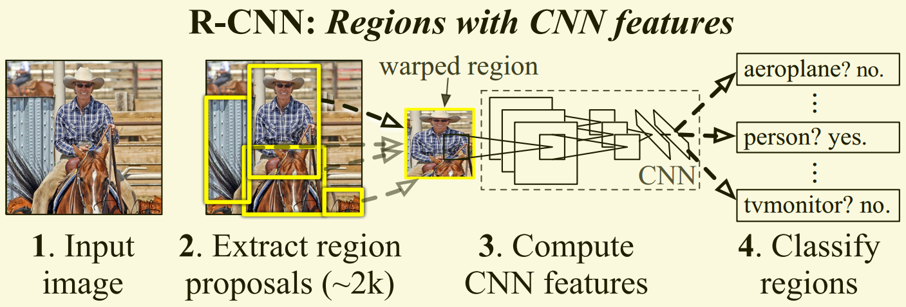
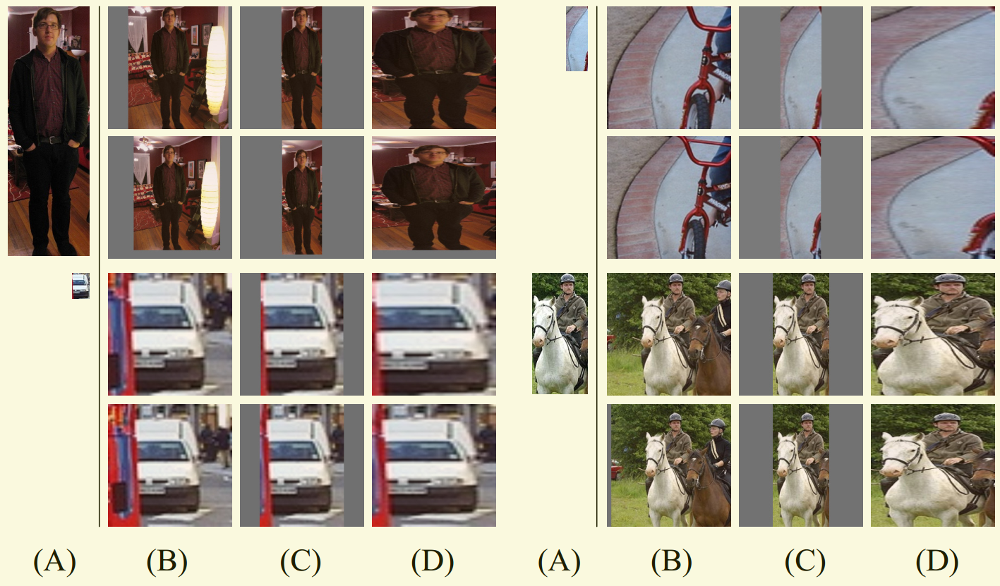
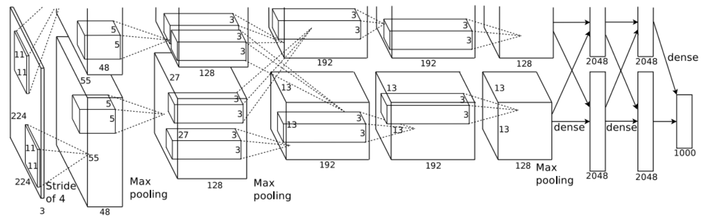
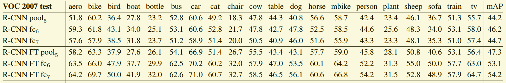

# Rich feature hierarchies for accurate object detection and semantic segmentation

***Publisher:  CVPR 2014***
<a href='https://arxiv.org/abs/1311.2524' target='_blank_'>论文链接</a>


目录
=================

   * [Rich feature hierarchies for accurate object detection and semantic segmentation](#rich-feature-hierarchies-for-accurate-object-detection-and-semantic-segmentation)
      * [1.概述](#1概述)
      * [2.整体过程](#2整体过程)
         * [2.1 模型的大概整体过程](#21-模型的大概整体过程)
         * [2.2 Bbox](#22-bbox)
         * [2.3 IoU](#23-iou)
         * [2.4 非极大值抑制](#24-非极大值抑制)
         * [2.5 hard negative mining（难例挖掘）](#25-hard-negative-mining难例挖掘)
      * [3.模型详细介绍](#3模型详细介绍)
         * [3.1 候选区的生成算法-选择搜索](#31-候选区的生成算法-选择搜索)
         * [3.2 图像特征提取以及分类模型](#32-图像特征提取以及分类模型)
            * [3.2.1 测试过程中](#321-测试过程中)
            * [3.2.2 训练过程中](#322-训练过程中)
            * [3.2.3 Bounding-box regression](#323-bounding-box-regression)
            * [3.2.4 一些消融实验](#324-一些消融实验)


***部分参考资料***
<a href='https://www.jianshu.com/p/5056e6143ed5' target='_blank_'>RCNN介绍1</a>
<a href='https://zhuanlan.zhihu.com/p/94621030' target='_blank_'>RCNN介绍2</a>
<a href='https://www.cnblogs.com/soulmate1023/p/5530600.html' target='_blank_'>RCNN介绍3</a>
<a href='https://blog.csdn.net/briblue/article/details/82012575' target='_blank_'>RCNN介绍4</a>
<a href='https://www.zhihu.com/question/39405815' target='_blank_'>非极大值抑制1</a>
<a href='https://www.cnblogs.com/makefile/p/nms.html' target='_blank_'>非极大值抑制2</a>
<a href='https://www.zhihu.com/question/46292829' target='_blank_'>hard negative mining</a>
<a href='https://www.cnblogs.com/zyly/p/9259392.html' target='_blank'>selective search</a>


## 1.概述

&emsp;&emsp;因为没有读过以前的一些物体检测算法，例如HOG等，所以不是特别清楚以前的物体检测算法的具体原理，RCNN应该是基于卷积神经网络的第一种使用深度学习的方法来进行物体检测的算法。目前的物体检测可以包含下面的几部分：

<div align=center>


<p>图1-1 目标检测的几种任务</p>
</div>

&emsp;&emsp;这个主要是从图片分类逐渐到语义分割，图片分类是针对整张图片进行的泛泛的分类，一般要求一张图片里面只包含一个目标，而包含多个目标的话可能分类的效果就比较差了。而单目标检测就是在图像分类的基础上，将目标的位置用矩形框框起来，定位到具体的分类目标的位置上。而多目标检测就是一张图片里面包含多个目标，而且这些目标不一定是同一类对象，需要用矩形框将目标框出来，并进行正确的分类。而语义分割就是在多目标检测的基础上对目标进行描边，圈选出目标的具体位置。 


## 2.整体过程


### 2.1 模型的大概整体过程

&emsp;&emsp;RCNN的大概整体过程是，通过候选区生成算法，生成2000个候选区，然后使用AlexNet（修改之后的）对这2000个候选区进行特征提取，最后使用SVM进行分类，来确定哪些是我们需要保留的，哪些是需要遗弃的。最后对保留下来的候选框进行合并，获得最终的定位和分类结果。如图2-1所示：

<div align=center>


<p>图2-1 RCNN整体过程</p>
</div>

&emsp;&emsp;下面介绍一些相关的概念。

### 2.2 Bbox

&emsp;&emsp;Bbox（Bounding Box）表示的是一个可以框选住物体的最小矩形框，例如图1-1中的红蓝绿的矩形框，目标检测中，关于目标的位置信息输出一个四元组（x, y, w, h)，其中x和y代表坐标，可以表示图片的左上角坐标或者其他地方的一些坐标，而w和h表示矩形框的宽和长，这样一个四元组可以唯一的确定一个矩形框的位置。

### 2.3 IoU

&emsp;&emsp;IoU是目标检测的一个评估标准，其计算方式如图2-2所示，$IoU = \frac{P \cap T}{P \cup T}$，其中P表示预测的面积和位置，T表示真实的面积和位置。

<div align=center>

<p>图2-2 IoU示意图</p>
</div>

### 2.4 非极大值抑制

&emsp;&emsp;非极大值抑制（Non-Maximum Suppression， NMS）的意思就是如果不是极大值，那么就抑制这个值。而极大值本身就是一个局部的概念，所以这里也可以人为是局部最大搜索。

&emsp;&emsp;在目标检测中，对于每个候选窗口都会被打上一个分数，但是因为候选窗口很多，难以避免的会有重复的情况出现，如何更好的选出重复的里面的最好的那个，就需要使用非极大值抑制的思想来解决这个问题了，算法步骤如下：

1.首先要求模型提取出来候选区域，并且将候选区域分好类，同时对所有的候选区域打上分数，也就是模型认为的置信度，将这些所有区域根据各自的类别放到输入区。
2.之后从某个类别中抽取出来得分最高的那个候选区域，放入到输出区中，并从输入区剔除这个候选区。
3.从和这个候选区域相同类的输入区中选择第二个候选区，然后计算IoU(候选区1，候选区2)的得分，如果得分大于了设定的阀值，那么就剔除候选区2，否则就放到输出区中，并从输出区删除这个候选区。
4.重复步骤2和3，直到所有的输入区都没有候选区域了位置，那么算法结束。


### 2.5 hard negative mining（难例挖掘）

&emsp;&emsp;这里是RCNN参考的两篇论文，但是我没有去读，也没有看RCNN的实现，所以这里看的都是网上总结的，<a href='https://www.zhihu.com/question/46292829' target='_blank'>参考1</a>，<a href='https://blog.csdn.net/qq_36570733/article/details/83444245' target='_blank'>参考2</a>。其大概的步骤如下：


1.将目标检测中的有标签的数据划分为正例和负例，但是一般情况下，负例远远的多于正例，为了保证训练出来的模型不会因为数据的失衡而无法正常的训练，所以采用难例挖掘的方式，看网上的说的，很多人人为输入的正负比例为1:3，可能是根据RCNN中微调过程中采用的32:96的比例。

2.有了数据之后，就可以进行训练，这个时候输入的负例数据都是随机抽取的，是所有负例的一个子集，也没有所谓的hard negative这样的数据，经过训练之后我们获得一个分类器。

3.使用2中训练好的分类器，开始对负例进行分类，将其中分成假正例的，这里设置一个阀值，如果得分高于这个阀值了，就认为这个是hard negative，然后将这个加入到下一轮需要进行训练的负例数据集中。之后进行下一轮训练。

4.如此往复，直到分类器的性能不再上升，就可以停止了。

*&emsp;&emsp;这里我感觉可以引申一下，针对数据集不平衡的情况，一般很容易将某个类别较少的类分错，这样的话我们可以将每次分错的这些数据加入到一个错题集中，然后参与下一轮的训练，这样可以提高类别较少的类的曝光率，并且提升模型对分错数据的学习能力。*


## 3.模型详细介绍

&emsp;&emsp;模型主要分类3部分，分别是生成候选区域的算法，提取图像特征的CNN网络以及最终分类的SVM分类器。下面将分为两个大部分来介绍这三个部分。

### 3.1 候选区的生成算法-选择搜索

&emsp;&emsp;这里有很多候选区域的生成算法，作者为了和之前的一些目标检测算法进行比较，这里选择了selective search算法。

&emsp;&emsp;因为为了对目标进行定位，需要使用滑动窗口慢慢的截取图像中的区域，然后用分类器进行分类确定是否是需要的目标。这样做的方法显然是暴力搜索，肯定是不合适的，因为效率绝对是一个大问题。所以后来人们根据图片的颜色，文理，大小等一些策略来对图像中的目标进行定位，但是实际情况是，针对不同的图像，使用这里面的任意一种方法都没法很好的进行目标的定位，比如颜色，变色龙的颜色和周围环境几乎一致；比如说纹理，两只花豹的纹理也几乎一致，而大小，是很难确定的，比如桌子上面有碗，碗里有勺子和饭菜。

&emsp;&emsp;而selective search的策略就是，既然不知道我们需要的目标大小是什么样的，那么我们就进行穷举就行了，但是不同于暴力搜索，这里是基于图像的分割来得到小的区域，然后再对小的区域进行合并，而获得小的区域就是采用多种策略来应对多种图像，例如颜色，纹理，大小等。

&emsp;&emsp;因为没有看原论文，所以这里主要参考了<a href='https://www.cnblogs.com/zyly/p/9259392.html' target='_blank'>博客</a>，其中selective search算法的伪代码如下：

```
输入: 一张图片
输出：候选的目标位置集合L

算法：
1: 利用切分方法得到候选的区域集合R = {r1,r2,…,rn}
2: 初始化相似集合S = ϕ
3: foreach 遍历邻居区域对(ri,rj) do
4:     计算相似度s(ri,rj)
5:     S = S  ∪ s(ri,rj)
6: while S not=ϕ do
7:     从S中得到最大的相似度s(ri,rj)=max(S)
8:     合并对应的区域rt = ri ∪ rj
9:     移除ri对应的所有相似度：S = S\s(ri,r*)
10:    移除rj对应的所有相似度：S = S\s(r*,rj)
11:    计算rt对应的相似度集合St
12:    S = S ∪ St
13:    R = R ∪ rt
14: L = R中所有区域对应的边框
```

&emsp;&emsp;这里采用了基于图的图像分割方法进行的初始化原始区域，但是这个我没有仔细去看，这里也就不记录了。下面主要是将图像分割成的很多小块进行拼接，这里使用的是贪心策略，计算每两个相邻的区域的相似度，然后每次合并最相似的两块，知道最终剩下一个完整的图片。其中每次产生的图像块我们都保存下来，这样就获得了图像的分层表示了，计算图像块的相似度分成四部分：颜色相似度，纹理相似度，优先合并小的区域，选择合适的区域距离（这里还有一些细节问题，但是没看太懂，就不记录了）。这里计算相似度的时候都是将相似度的值归一化到[0, 1]之间了，1表示两个区域相似度很大。

**颜色相似度**

&emsp;&emsp;使用L1归一化获得到每个区域的每个颜色通道的25bins的直方图（这里直接搜图像直方图），相当于一个一个区域获得一个75维的向量（25*3）$\{ c_i^1, ..., c_i^n\}$，然后使用下面的公式计算两个区域$r_i$和$r_j$颜色的相似度：

$$
s_{colour}(r_i, r_j) = \sum^{n}_{k=1}min(c_i^k, c_j^k)
$$

&emsp;&emsp;这个公式的含义如下：对于每个区域的颜色向量$C_i = \{ c_i^1, ..., c_i^n\}$， 因为是归一化之后的值，所以每个区域的所每个通道的颜色的向量特征相加为1，一整个区域也就是3。如果区域$r_i$和$r_j$是同一个区域，那么他们的颜色特征向量应该是完全相同的，那么如果每次都取对应的特征向量的最大值，那么最终的累加结果就是3，如果$r_i$和$r_j$不是完全一样，每次都取对应的特征向量中较小的那个，那么最终这两个区域的颜色相似度得分也会比较低。如果需要对两个区域进行合并，那么对新的区域的颜色特征进行重新计算，下面的相似度合并之后的计算是类似的：

$$
C_t = \frac{size(r_i) \cdot C_i + size(r_j) \cdot C_j }{size(r_i) + size(r_j)}
$$

**纹理相似度**

&emsp;&emsp;这里的纹理采用SIFT-Like特征，具体就是对每个颜色通道的8个不同方向计算方差$\sigma=1$的高斯微分（Gaussian Derivative），然后使用L1归一化可以获得图像区域的每个颜色通道的每个方向的10bins直方图，一共获得240维的特征向量（10\*8\*3）$T_i = \{t_i^1, ..., t_i^n\}$，不同区域之间的纹理相似度计算方式如下：

$$
s_{texture}(r_i, r_j) = \sum^{n}_{k=1}(t_i^k, t_j^k)
$$

&emsp;&emsp;合并区域的新的纹理特征的计算方法和颜色相似度的计算方法类似。

**优先合并小区域**

&emsp;&emsp;因为如果仅使用颜色和纹理特征合并的话，很容易导致合并之后的区域不断的吞并周围的区域，为了解决这样的问题，需要给小区域更大的权重，这样就保证所有的图像都可以平等的参与图像的合并：

$$
s_{size}(r_i, r_j) = 1 - \frac{size(r_i) + size(r_j)}{size(im)}
$$

&emsp;&emsp;其中size(im)表示整个图像的面积，上面的公式表明，两个区域的面积越小，那么其相似度越到，即越接近于1.

**选择合适的区域距离**

&emsp;&emsp;如果区域$r_i$包含区域$r_j$，那么这个相比于区域$r_i$和区域$r_j$不相邻，肯定需要最先合并前者。所以这里定义一个距离权重函数来衡量两个区域是否应该合并：

$$
s_{fill}(r_i, r_j) = 1 - \frac{size(BB_{ij}） - size(r_i) - size(r_j)}{size(im)}
$$

&emsp;&emsp;公式中的$BB_{ij}$表示的是Bounding Box的面积，如果BB越小，那么说明这两个区域的吻合度越高，那么这个距离相似度也就越高了。

**合并四个相似度**

&emsp;&emsp;将上面四种相似度的计算结果加权相加即可：

$$
s(r_i, r_j) = \alpha_1 s_{colour}(r_i, r_j) + \alpha_2 s_{texture}(r_i, r_j) + \alpha_3 s_{size}(r_i, r_j) + \alpha_4 s_{fill}(r_i, r_j)
$$
其中$\alpha_i \in \{ 0, 1 \}$

**给区域打分**

&emsp;&emsp;通过上面的步骤，就可以得到很多候选区域了，但是并不是所有的候选区域都是我们需要的，所以我们需要对这些候选区域进行打分，论文中打分的标准就是给予最开始拼接的图片较大的权重，例如最后拼接的图片打1分，那么倒数第二次拼接的就打2分，依次类推。但是这样会带来一个问题，就是重复的权重太多了，没法很好的排序，所以文章就给每个权重乘以一个随机的数字，这样就可以将这些区域分割开了。其次，对于相同的区域的多次出现是可以给这个区域累加权重的，多种策略都认为这个区域是目标，那么给这个区域的权重进行累加也很正常了。

### 3.2 图像特征提取以及分类模型

&emsp;&emsp;提取出来的图像区域，可以用CNN进行特征的提取，输入的是227*227的图像，然后获得的是一个4096维的图像特征向量，然后通过SVM进行分类。这里面有很多细节问题，下面一点一点的讨论。

#### 3.2.1 测试过程中

&emsp;&emsp;首先看最简单的测试过程，测试的时候，先使用selective search算法生成2000个候选区域，然后使用CNN进行特征的提取，之后使用SVM进行分类，并使用非极大值抑制来剔除不需要的候选框，

#### 3.2.2 训练过程中

&emsp;&emsp;训练过程比较复杂，下面慢慢介绍：

**预训练**

&emsp;&emsp;这一步就是将AlexNet，用ImageNet数据集进行预训练，当然实际上这里使用的并不是原始的AlexNet，而是后期进行了一些修改的AlexNet。

**特定领域内的微调**

&emsp;&emsp;这一步就是在目标检测的数据上进行微调了，对给定的训练数据，将候选区域和正式区域的IoU得分为0.5的作为正例，而其余的作为负例，对于不同的数据集，这里的分类数量不同，比如对于VOC数据集，是分成20个类，那么这里的分类数量就是21，其中的1表示非目标类；对于ILSVRC2013，是分成200个类，那么这里的分类数量就是201。

&emsp;&emsp;对于输入的图像，虽然都是227*227的，但是这里作者进行了实验寻找最合适的输入图像的方式。分为三种：

- tightest square with context
- tightest square without context
- warp

&emsp;&emsp;首先是第一种，表示的是，如果输入的图像不是正方形的，那么就以这个图像的中心为标准点，然后拓展成一个正方形的，如果拓展的过程中，原来的图像已经到了边界，那么剩余的部分就用图像的均值进行填充，最后将这个正方形图像缩放成227*227，如图3-1的B列；对于第二种，和第一种类似，但是它不进行拓展，直接使用图像的均值将原来的图像填充成正方形，然后再缩放，如图3-1的C列；对于第三种，直接进行放射变换，将图片变成227*227，如图3-1的C列。

&emsp;&emsp;这里作者还对图像进行了边界填充，如图3-1所示，每组图像的第一行是没有进行边界填充的示例，第二行是经过p=16的边界填充，原来的图像实际是195*195。

&emsp;&emsp;最后的实验表明，放射变换+填充p=16是效果最好的。

<div align=center>

<p>图3-1 RCNN的图像输入方式.png</p>
</div>

&emsp;&emsp;在确定好输入的图像的方式之后，每次进行微调的时候，输入32个正例，和96个反例，一共组成128个mini-batch进行训练。

**目标检测分类训练**

&emsp;&emsp;这里使用的是上面微调好的AlexNet，然后在AlexNet后面的在连接一个SVM分类器，为什么这样做呢？作者提出了以下两点原因：

- 首先是因为在这里进行训练的时候，训练的目标和微调阶段略有不同，微调的时候是认为IoU高于0.5就可以认为是正样本，而在训练目标检测的分类的时候，是将IoU高于0.7的认为是正样本（这一点是从网上看的，论文只是说将真实的bb框作为正样本，并没有具体说IoU值是多少 ），低于0.3的认为是负样本，中间的舍弃。这样的选择方法导致微调阶段和训练阶段的目标不一样。

- 而且实验表明直接使用微调时候的模型进行训练效果并不好，加上SVM之后效果比较好。作者认为加上SVM让模型在训练的时候可以获得一个更加纯净的分类器。

&emsp;&emsp;因为这里的负样本太多了，所以作者在这里使用了hard negative mining策略，来进一步提升模型的性能，并加快训练进度。但是这里有一个例外情况是，在ILSVRC数据集中，因为val和test数据集是将所有的目标都标注了出来，而train数据集仅仅标注了部分的目标，这样就导致train数据集无法应用到hard negative mining中，因为有些区域确实是目标，只是没有标注出来而已。所以这里的hard negative mining主要依靠val数据集，而train数据集仅提供正例。但是这里涉及到样本较少，样本不平衡的问题，这里我没有仔细看他是怎么处理的（虽然少，但是其实也挺多的，最少的是31张图片，但是生成的分割区域就很多了）


#### 3.2.3 Bounding-box regression

&emsp;&emsp;虽然前面已经能取到很好的性能了，但是实际上，因为使用selective search生成的候选框，在精度方面还有有点差，所以后期需要进行微调来获得精度更好的回归候选框。这里使用的pool5生成的特征。首先我们有selective search生成的候选框$P = \{P^1, ..., P^n\}$，我们想要获得微调之后的候选框$\hat{G} = \{ \hat{G}^1, ..., \hat{G}^n\}$，真实的候选框为$G = \{G^1, .., G^n\}$。在训练的过程中，筛选用于训练的selective search生成的候选框的时候，要求$P^i$和$G^i$的IoU得分要大于0.6。其中$P^i = (P^i_x, p^i_y, p^i_w, p^i_h)$，前两个参数表示候选区$P^i$的中心坐标，而后两个参数表示候选区域$P^i$的长宽，$\hat{G}$和$G$的定义是类似的。那么我们通过$P^i$计算$\hat{G}$的公式如下：

$$
\begin{aligned}
\hat{G}_x & = P_w d_x(\varphi_5) + P_x \\
\hat{G}_y & = P_h d_y(\varphi_5) + P_y \\
\hat{G}_w & = P_w exp(d_w (\varphi_5)) \\
\hat{G}_h & = P_w exp(d_h (\varphi_5))
\end{aligned}
$$

&emsp;&emsp;上面的四个公式其实就是尺度缩放计算，其中中心坐标的尺度平移算子就是$P_w d_x(\varphi_5)$和$P_h d_y(\varphi_5)$，而长宽缩放算子就是$exp(d_w (\varphi_5))$和$exp(d_h (\varphi_5))$。其中的$d_{*}(\varphi_5)$（其中*表示x, y, w, h）表示的是对CNN的pool5的输出进行线性建模，也就是$d_{*}(\varphi_5) = w^T_* \varphi_5$，其中$w_*$是可训练的参数，这里假设的是pool5层的输出和图像的位置有隐式的关系，所以设计了上面的那样的计算公式。因为我们需要优化参数$w_*$，所以设定了如下的基于最小二乘法的损失函数：

$$
w_* = \underset{\hat{w}_*}{argmin} \sum^N_i(t^i_* - \hat{w}^T_* \varphi_5(P^i))^2 + \lambda|\hat{w}_*|^2
$$

&emsp;&emsp;为了优化上面的损失函数，获得合适的$w_*$的取值，我们需要的就是计算$t_*$，而$t_*$可以由上的尺度缩放计算推出，即将$\hat{G}$替换成$G$，这样的话就可以让回归BB预测的结果越来越接近真实的$G$:

$$
\begin{aligned}
t_x & = (G_x - P_x) / P_w \\
t_y & = (G_y - P_y) / P_h \\
t_w & = log(G_w / P_w) \\
t_h & = log(G_h / p_h)
\end{aligned}
$$


#### 3.2.4 一些消融实验

&emsp;&emsp;但是在这一步进行微调的时候，作者研究了AlexNet网络的后面几层网络的作用，AlexNet的结构图如图3-2所示，可以发现，其实AlexNet的参数量主要集中在后面的全连接层，所以作者从pool5层之后开始研究，pool5层就是针对CNN的输出进行池化。作者分两种情况做了实验，可以参考原文3.2，作者先是没有进行微调，直接进行的预测；之后进行微调，再进行预测。然后研究pool5层，fc6层和fc7层的输出的预测结果的得分。如图3-3所示，这里可以参考原文表2.

<div align=center>

<p>图3-2 AlexNet网络结构图</p>
</div>

&emsp:&emsp;根据作者的结论，如果是没有微调，直接拿预训练的模型来预测，就会发现（如图3-3第一大行的结果），后面的线性层似乎并没有什么特别大的改进，特别是fc7层的效果甚至还不如fc6，作者认为AlexNet的效果主要来自卷积神经网络层，而全连接层发挥的作用并不是很大。而如果经过微调之后（如图3-3第二大行的结果），就会发现微调的提升效果明显，特别是fc6和fc7针对不微调的而言，作者这里认为微调的性能提升主要来自非线性神经网络，但是全连接层fc6和fc7之间的差距不大，作者认为AlexNet从ImageNet中学习到的能力在pool5上是通用的，而不是说多增加非线性分类器就可以大幅度提升性能。

<div align=center>

<p>图3-3 AlexNet的后面几层网络的性能研究</p>
</div>

&emsp;&emsp;作者这里还对比了AlexNet和VGG16，虽然VGG16相对比AlexNet有提升，但是VGG16的复杂度比AlexNet高了7倍，所以最终为了考虑效率问题，最终还是选择了AlexNet网络。


