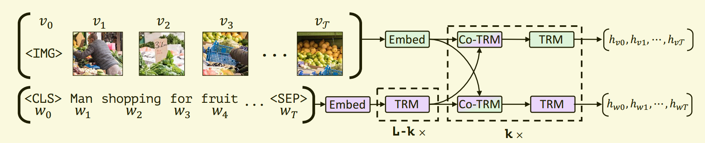

# 多模态预训练模型总结

[TOC]

## ViLBERT

2019年8月

#### 整体概述

图1 ViLBERT整体示意图

&emsp;&emsp;ViLBERT模型的整体结构如图1所示，首先是将文本通过bert进行特征提取，获得词向量特征（也就是图中的TRM部分），然后将图像使用基于ResNet的Faster RCNN提取出来可信度比较高的一些图像区域，然后对这些图像区域进行一个平均池化，获得图像的embed。之后将这两者输入到Co-attention Transformer中，之后就可以得到文本和图像的特征向量了。

&emsp;&emsp;这里使用的数据集来自Concepytal Captions，包含3百3十万对图像-文本对。

#### Co-attention Transformer

图2 VilBERT的co-attention模块

&emsp;&emsp;图2是论文中使用的Co-attention Transformer模型，从图中就可以看到其实就是将文本输入的K和V变成图片的输入，图片的同样也换成文本的K和V。

#### 训练任务

图3 VilBERT的训练任务

&emsp;&emsp;从图3可以看到ViLBERT的训练其实和原始的BERT也是一样的。

- 一个就是Mask遮罩任务，分别针对文本和图像进行MASK，对于文本的MASK操作和BERT是一样的，但是图像略有不同，图像mask了10%的数据，然后在预测被MASK的部分的时候，文本的和bert是一样的，但是图像不一样，图像是直接用另外一个预训练模型的输出作为评分标准，然后计算本模型的输出和标准输出的KL距离，作者认为这里是对图像的一个高级特征进行对比。（作者这里认为，语言是图像的高级特征，所以不太可能从语言可以确切的重建图像的特征）

- 另外一个就是文本图像对训练任务，就是判断图像和文本是否是同一对。

## VL-BERT

2019年3月  9月发表

#### 整体概述

图4 VLBERT模型整体示意图

<a href='https://blog.csdn.net/xixiaoyaoww/article/details/105036223' target='_blank'>参考链接</a>

&emsp;&emsp;从图4中可以看到，整体的结构还是BERT，输入的数据方式有点不一样。首先是文本的输入，除了正常的段embedding，位置embedding和token embedding之外，还有输入了图像的embedding，而且还是完整的图像（这里或许是因为作者认为模型无法和图像进行正确的对齐，于是就直接输入了完整的图像）。然后是图像的输入部分，这部分直接使用图像的核心RoI部分，然后再加上[IMG]标志位输入，但是图像并没有位置信息，因为作者认为提取的RoI的输入顺序应该和最终的结果预测没有任何关系，于是就应该是无序输入的。

#### 预训练任务

- 文本+图像预测被MASK的文本token
- 文本+图像预测被MASK的图像的类别：这里为了防止前面输入的全部图片泄露了MASK的图片信息，在输入图片的时候，会把图片中的需要被MASK的那块图片MASK掉。

## VisualBERT

2019年8月

没有发表的工作，类似VLBERT

## LXMERT

2019年12月

#### 整体概述

图5 LXMERT模型整体示意图

&emsp;&emsp;如图5所示，LXMERT的模型整体是基于Transformer的，同时内部加入了Cross-Modality Encoder。首先是文本的输入，输入包括文本本身的词向量和文本的位置信息，图像的输入包括经过Faster RCNN识别出来的图像区域以及根据图像区域的位置生成的位置信息；之后文本和图像分别通过两条Transformer；之后就进入到了Cross-Modality Encoder层；最后的输出图像的特征信息和文本的特征信息，同事文本的CLS位置的输出作为图像和文本的交叉模态特征的输出。

&emsp;&emsp;这里并没有使用BERT作为一个基础模型，这里的$N_R$，$N_L$，$N_X$分别是5，9，5。之所以文本的Transformer编码器的层数多于图像，作者这里认为这是为了平衡文本和图像的初始特征，因为图像的初始特征来源于ResNet-101，而文本的并没有经过什么预训练模型。

#### Cross-Modality Encoder

&emsp;&emsp;如图5所示，交叉模态的编码层内部其实和Transformer很类似，只是增加了一个交叉attention，对于交叉attention的输入，q和v来自自己的模态，但是k来自对方的模态。

#### 模型的预训练任务

图6 LXMERT模型训练任务

&emsp;&emsp;这里的预训练任务包含了3种，分别是针对文本的，针对图像的，以及针对多模态的。

- 针对文本的任务：文本的MASK任务

- 针对图像的：
  图像回归任务：即使用L2 loss。对图像的的输出进行损失计算
  图像标签预测任务：图像标签来自Faster RCNN的识别结果

- 多模态任务：
  交叉模态匹配任务：也就是看图片和文本是不是来自同对数据
  问答任务：文本输入的为问题，然后预测要选择的问题答案

## Unicoder-VL

2019年12月最后一版

#### 整体概述

图7 Unicoder-VL模型整体结构

&emsp;&emsp;可以看到，这个模型和上面的VLBERT实际上差不多，输入的图像包括了位置信息，位置信息的来源比较复杂，包括5个值，分别是$b = (\frac{x_1}{W}, \frac{y_1}{H}, \frac{x_2}{W}, \frac{y_2}{H}, \frac{(y_2 - y_1)(x_2 - x_1)}{W \cdot H})$，通过这5个值，经过线性层，然后转换之后加到图片中。

#### 预训练任务

- 基于文本的掩码语言模型：和BERT的MLM类似，这里只是同时输入了图片信息
- 基于图像区域的掩码类别预测：这里是对输入的图像RoI区域进行MASK，然后让模型预测其对应的类别
- 图像文本匹配：判断图片是文本是不是一对，用于学习图片和文本的全局信息

## Unified Vision-Language Pre-Training for Image Captioning and VQA

2019年12月最后一版

#### 整体概述

图8 UVL模型整体示意图

&emsp;&emsp;可以看到模型整体结构和BERT是一样的，文本的输入和BERT一样，但是这个图像的输入略有一点创意，对于图像的部分，其中$\{r_1, ..., r_N\}$表示图像RoI特征，而这个图像特征是由另外三个特征表示的，分别是图像的特征向量$R = [R_1, ..., R_N]$，图像RoI对应的标签$C=[C_1, ..., C_N]$，图像RoI的坐标信息$G=[G_1, ..., G_N]$，其中坐标包括5个值，分别是图像的左上角坐标，右下角的坐标以及图像的绝对位置。然后经过将图像标签和图像位置加入到图像特征向量中，得到对应的$r$特征向量：

$$
r_i = W_rR_i + W_P[LayerNorm(W_cC_i);LayerNorm(W_gG_i)]
$$

&emsp;&emsp;输入的时候，[CLS]作为所有token的开头输入，[SEP]作为图像和文本的分割符，[STOP]作为文本的结束输入标志

#### 预训练任务

图9 UVL模型预训练任务

- 文本MASK，和BERT是一致的
- Image Captioning：这部分包括了预训练和下游任务的微调，因为这个模型本身设计的就是为了Image Captioning。这部分就是将图片输入到模型中，文本全部用[MASK]来代替，每次输入一个[MASK]，然后预测出来一个词，就替代这个[MASK]，之后新的[MASK]就会被输入到模型中，一直到预测出来[STOP]为止。
- VQA：这个是下游任务，不是预训练任务，这部分的输入是[CLS]和[SEP]的输出作为分类标准。

## VideoBERT

<a href='https://blog.csdn.net/xixiaoyaoww/article/details/104623997' target='_blank'>参考链接</a>

#### 模型整体结构

图10 VideoBert整体结构

&emsp;&emsp;这个预训练模型其实是针对视频的，为了将数据输入到BERT中，需要对视频作图像和语音方面的处理。对于图像，先从每个视频的每一秒中抽出20帧，然后每30帧组成一个clip，之后使用预训练号的卷积网络提取每个clip的特征，转换成1024维的向量，由于整个特征向量空间比较庞大，所以这里先对所有的特征向量进行一个层次k-means聚类，然后得到了20736个类中心；之后就将每个clip对应的类中心作为visual token输入到模型中。

&emsp;&emsp;至于文本信息，使用成熟的语音识别工具获得视频的文本，然后利用LSTM的语言模型对齐断句，之后就可以输入到BERT中了。

#### 预训练任务

- MLM任务：和BERT一样，只是这里还MASK了图像的token
- NSP任务：预测文本和图像是不是来自同一个视频

## UNITER

2020年9月最后一版

#### 整体结构

图10 UNITER模型整体结构

&emsp;&emsp;可以从图中看到图像和文本的输入都是原始内容加上位置信息，图片是使用Faster RCNN分割出来的，同时不同的RoI片段会对应着其类别标签。然后输入到模型中进行训练。

#### 预训练任务

- MLM任务：和BERT类似，直接对文本进行MASK，然后预测被MASK的文本
- MRM任务：对图像进行MASK，但是这里分了三个任务
  1.首先是一个被MASK掉的RoI区域回归任务，对于模型的被MASK的图片RoI的输出结果和输入特征进行一个L2距离回归
  2.之后是一个分类，对被MASK的那部分图像进行一个标签的预测
  3.最后是一个KL-距离计算，因为考虑到图像RoI的类别不一定完全正确，所以这里相当于使用软标签进行分类
- WRA任务：要求对RoI片段和文本进行对齐
- ITM任务：判断文本和图片是不是一对的

## 12 in 1

2020年4月最后一版

本文修改了ViLBERT的预训练过程，有两个小修改：
1. 对regions进行mask时，将IoU大于0.4的regions也mask掉，避免视觉信息泄漏；
2. 在多模态对齐的负样本采样时，不强制masked multi-modal modelling loss，这样可以有效地降低负样本带来的噪声（似乎就是去除了NSP任务）。

&emsp;&emsp;之所以叫12 in 1，是因为这里的模型在12个数据集上面进行了预训练。相当于加大了训练的数据量。

## Oscar

2020年7月最后一版

#### 模型整体结构

图11 OSCAR的出发点

&emsp;&emsp;如图11所示，OSCAR出发点就是先获得图像RoI片段和其对应的标签，然后希望模型自动对齐图像的标签和文本信息，因为如图11的c所示，图片中的狗和沙发距离都比较近，但是文本中的狗和沙发距离比较远，所以作者希望通过这样的方式来学习到文本和图片的信息，达到一个互补的作用。

图12 OSCAR模型的整体结构

&emsp;&emsp;实际实现就是将文本和图片的标签拼接在一起，然后再加入图像RoI，同时加入了位置信息。

#### 预训练任务

- MLM任务：类似BERT的Mask任务
- 判断文本和标签是否匹配任务

### CLIP

图 CLIP的模型示意图

#### 对比学习

参考： <a href='2021-3-15-对比学习.md' target='_blank'>2021-3-15-对比学习.md</a>

### DALL-E

图 DALL-E可能的模型示意图

离散变分自解码器

#### 

### M6