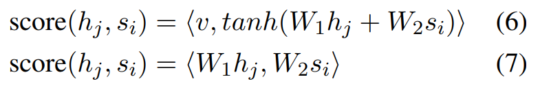
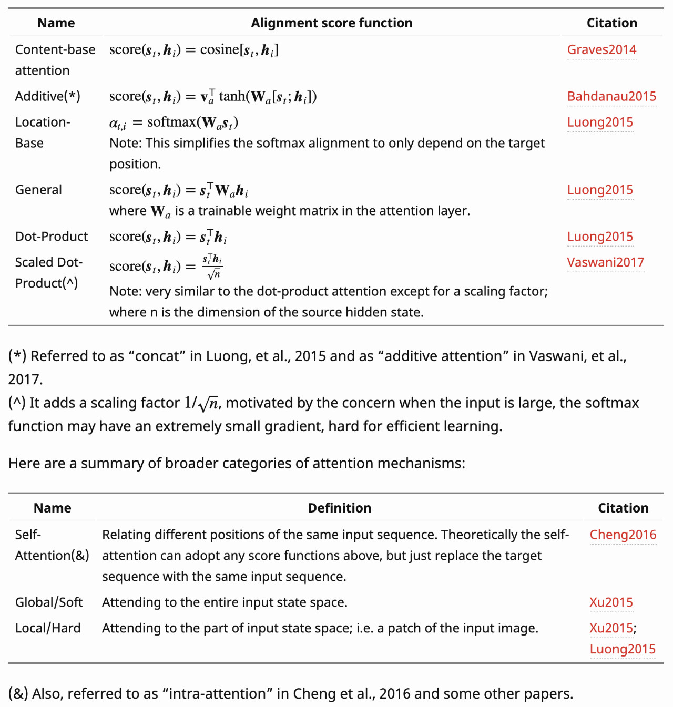
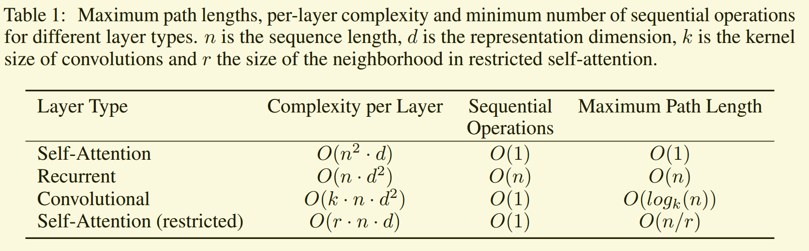

<a href='https://zhuanlan.zhihu.com/p/148656446' target='_blank'>参考链接-20个Transformer问题</a>

<a href='https://zhuanlan.zhihu.com/p/149799951' target='_blank'>参考链接-20个Transformer问题部分答案</a>

<a href='https://aijishu.com/a/1060000000092072' target='_blank'>参考链接-33个NLP问题</a>

[TOC]

### 1.Transformer为什么使用多头注意力机制

多头注意力机制保证了模型可以关注到不同的子空间信息，进而捕捉到更加丰富的特征信息，实验结果证明多头确实可以增加模型的效果，但是可视化的结果显示出来大部分情况下，多个头的注意力方式是一致的，可能只有个别的头的注意力方式和其他的不一样。

其实一个头的效果也不差，但是我们为了追求更好的结果，比如那一两个比较例外的头，就需要加入多头注意力机制

### 2.Transformer中的Q和K为什么使用不同的权重矩阵（全连接层）产生，为什么不适用同一个值进行自身的点乘。

自注意力的本质就是使用相同的输入，生成不同的Q,K，V进行注意力计算，而注意力的本质应该是进行Q和K的匹配，因为是Q和K的点乘，所以大概率情况下是相近的值乘出来的结果更大。所以如果Q和K是一致的话，那么乘出来的结果经过softmax就会变成一个单位矩阵的attention权重分布，这样本身想对V进行加权计算，结果变成了一个简单的线性映射，就让attention失去了原有的特征提取效果

### 3.Transformer中计算attention的权重值的时候为什么使用点乘，而不是加法？

<a href='https://arxiv.org/abs/1703.03906' target='_blank'>参考论文</a>

<a href='https://blog.csdn.net/taoqick/article/details/107010068' target='_blank'>参考链接</a>

这里指的乘法和加法，实际是下面这个步骤里面的,(6)表示加法操作，(7)表示乘法操作：

*加法的操作参考下面16.注意力机制有哪些不同的类型，这是一种固定操作*

原因是乘法计算的更快，虽然矩阵的加法看似简单，但是因为外面还加了tanh激活函数，也加了一个v，这样导致它的计算复杂度也并不怎么低。同时因为attention操作只是Transformer中的一部分计算，其中的计算还分布在layernorm和FFN层。还考虑到因为矩阵乘法的有比较成熟的加速算法，所以Transformer采用了乘的形式。

在论文Massive Exploration of Neural Machine Translation Architectures中针对加法和乘法计算进行了效果的对比，发现加法效果较好，这个效果的变化是随着attention计算中维度$d_k$的变化而变化的。作者推测是因为当$d_k$增大的时候，点乘会得到一个非常大的结果，将结果推向了softmax的梯度平缓区，影响了训练过程。所以Transformer中引入了一个温度因子$\sqrt{d_k}$来缓解这种情况

### 4.为什么在进行softmax之前，需要对attention进行一个scaled（缩放，除以$\sqrt{d_k}$）

<a href='https://www.zhihu.com/question/339723385/answer/782509914' target='_blank'>参考链接</a>

大概意思应该是，输入的数据经过softmax之后，会放大不同维度之间数据的差异性，这就导致在梯度传播的时候，大部分梯度分给了数据较大的那个维度，其他维度变成0了，这就导致了梯度消失的问题，造成参数更新困难。

### 5.在计算attention的分数的时候如何对padding作mask操作

在送入到softmax之前，将要padding的部分变成负无穷，一版设置成一个比较小的数字就行了，比如-100000，然后在送入到softmax计算就行了。

### 6.Transformer为什么在进行多头注意力的时候需要对每个head进行降维

大概是想在不增加计算量（时间复杂度）的情况下，借鉴CNN的多核six，在更低维度和多个的独立特征空间上，学习到更丰富的特征信息。其实也是在实验之后验证了它的有效性。

### 7.为何在输入词向量之后需要对矩阵乘以embedding size的开方？

因为embedding矩阵的初始化方式是xavier init，这种方式的方差是1/embedding size，乘以开方，刚好让方差变成1，这个缩放更有利于embedding矩阵的收敛。

### 8.位置信息相关

### 9.为什么使用layer norm，而不是用其他的归一化方法

### 10.Transformer如何并行化？解码器端可以做并行化吗？

### 11.WordPiece model和字节对编码

<a href='https://zhuanlan.zhihu.com/p/86965595' target=_blank'>参考链接</a>

### 12.Transformer训练的时候学习率如何设定

预热之后下降

### 13.为什么BERT在第一句前面会加[CLS]标志

因为与文本中已有的其它词相比，这个无明显语义信息的符号会更“公平”地融合文本中各个词的语义信息，从而更好的表示整句话的语义。

### 14.BERT非线性的来源在哪里

前馈层的gelu激活函数和self-attention，self-attention是非线性的

### 15.BERT为什么不采用Transformer中在attention内使用的mask技巧，而采用[MASK]占位符？

使用MASK作为占位符，相当于告诉模型这里有一个词，但是这个词需要模型区预测出来。而Transformer的mask技巧相当于告诉模型，这个词不需要了，那模型也就没法区预测这个词了。

### 16.注意力机制有哪些不同的类型

### 17.AdamW和Adam的区别

参考：<a href='2021-3-16-优化器.md' target='_blank'>面试/2021-3-16-优化器.md</a>

### 18.LSTM和Tansformer的时间复杂度

Transformer的论文中给出了这个复杂度，具体的可以参考<a href='https://zhuanlan.zhihu.com/p/132554155' target='_blank'>参考链接1</a>和<a href='https://zhuanlan.zhihu.com/p/264749298' target='_blank'>参考链接2</a>

### 19.Transformer在哪里做了权重共享，为什么可以做权重共享？

Transformer在两个地方进行了权重共享：

（1）Encoder和Decoder间的Embedding层权重共享；

（2）Decoder中Embedding层和FC层权重共享。

对于（1），《Attention is all you need》中Transformer被应用在机器翻译任务中，源语言和目标语言是不一样的，但它们可以共用一张大词表，对于两种语言中共同出现的词（比如：数字，标点等等）可以得到更好的表示，而且对于Encoder和Decoder，嵌入时都只有对应语言的embedding会被激活，因此是可以共用一张词表做权重共享的。

论文中，Transformer词表用了bpe来处理，所以最小的单元是subword。英语和德语同属日耳曼语族，有很多相同的subword，可以共享类似的语义。而像中英这样相差较大的语系，语义共享作用可能不会很大。

但是，共用词表会使得词表数量增大，增加softmax的计算时间，因此实际使用中是否共享可能要根据情况权衡。

该点参考：https://www.zhihu.com/question/333419099/answer/743341017

对于（2），Embedding层可以说是通过onehot去取到对应的embedding向量，FC层可以说是相反的，通过向量（定义为 x）去得到它可能是某个词的softmax概率，取概率最大（贪婪情况下）的作为预测值。

那哪一个会是概率最大的呢？在FC层的每一行量级相同的前提下，理论上和 x 相同的那一行对应的点积和softmax概率会是最大的（可类比本文问题1）。

因此，Embedding层和FC层权重共享，Embedding层中和向量 x 最接近的那一行对应的词，会获得更大的预测概率。实际上，Decoder中的Embedding层和FC层有点像互为逆过程。

通过这样的权重共享可以减少参数的数量，加快收敛。

Embedding层参数维度是：(v,d)，FC层参数维度是：(d,v)，可以直接共享，但是计算的时候要进行一个转置？其中v是词表大小，d是embedding维度。

### 20.BERT的三个Embedding直接相加会对语义有影响吗？

<a href='https://www.zhihu.com/question/374835153' target='_blank'>参考链接</a>

- 模型那么强大，总能区分出来加在一起的特征
- 可以直接将三个embedding连接，然后通过线性层变成原来的维度，应该也是等价的
- embedding的数学本质，就是以one hot作为输入的单层全连接，也就是说，世界上本没有什么embedding，有的知识one hot，embedding只不多是训练号的全连接层的参数罢了
- ... ...

### 21.BERT如何接近长文本问题

<a href='https://www.zhihu.com/question/327450789' target='_blank'>参考链接</a>

大概就是截断，使用滑动窗口，获得多个结果进行融合

### 22.为什么self-attention中没有使用激活函数

激活函数是为了增加非线性变化，而self-attention本身就具有非线性变化的能力，所以没有必要加入激活函数。
线性变化满足：f(kx) = kf(x)

### 23.Transformer参数量的计算方式

参考<a href='https://blog.csdn.net/weixin_43922901/article/details/102602557' target='_blank'>BERT模型的参数计算</a>