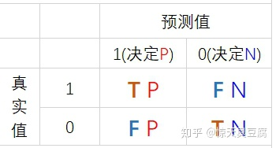

### AUC和ROC曲线

<a href='https://www.zhihu.com/question/39840928' target='_blank'>参考链接</a>

### F1值，精确率，召回率

<a href='https://zhuanlan.zhihu.com/p/166022017' target='_blank'>参考链接1</a>

<a href='https://zhuanlan.zhihu.com/p/97870600' target='_blank'>参考链接2</a>

图 混淆矩阵

精确率：预测为正的，占实际为正的比例

$$
P = \frac{TP}{TP+FP}
$$

召回率：实际正确的，预测对的占的比例

$$
R = \frac{TP}{TP + FN}
$$

F1:方便记忆的公式

$$
F1 = \frac{2}{\frac{1}{P} + \frac{1}{R}}
$$