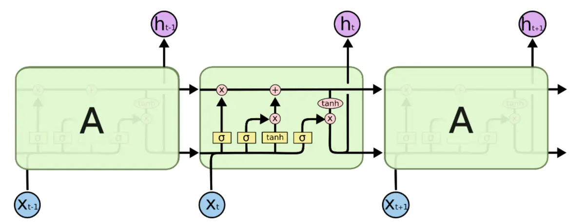
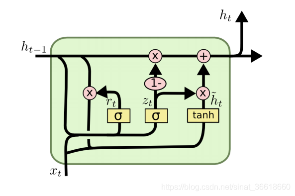

### RNN系列

#### LSTM

<a href='https://www.jianshu.com/p/4b4701beba92' target='_blank'>LSTM参考链接</a>

图 LSTM示意图

LSTM一共包含了3个门，依次为遗忘门，更新门和输出门（X号的那几个是门）。门使用sigmoid激活函数控制，信息的输入使用tanh函数控制

### GRU

<a href='https://blog.csdn.net/sinat_36618660/article/details/100798425' target='_blank'>GRU参考链接1</a>

<a href='https://zhuanlan.zhihu.com/p/32481747' target='_blank'>GRU参考链接2</a>

图 GRU示意图

GRU实际的门只有两个，依次为重置门和控制门，但是和LSTM一样包含三个X号，只不过最后的更新门和输出门都是一个控制门来控制的。

### 为什么LSTM也会产生梯度爆炸和梯度消失

### CNN系列

#### 残差结构

#### 空洞CNN

### Transformer系列

#### 初始的Transformer结构

#### transformer-xl结构

#### 稀疏的transformer