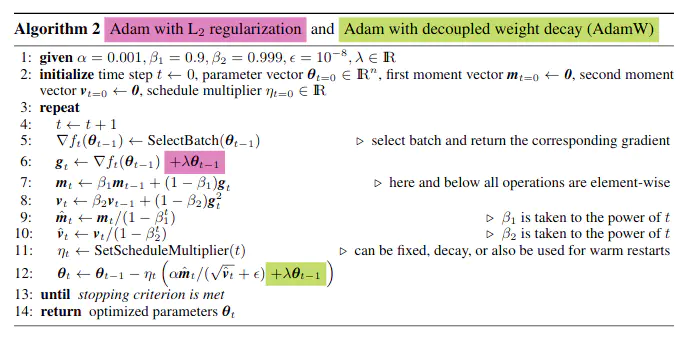

<a href='https://www.cnblogs.com/guoyaohua/p/8542554.html' target='_blank'>优化器</a>

百面机器学习160-162页

### adamw优化器

<a href='https://www.jianshu.com/p/e17622b7ffee' target='_blank'>优化器</a>

图 adam和adamw的区别

其实就是加入正则的位置的问题，adam是直接在梯度上面加入正则，之后才参与了m和v的运算。而adamw是在最后进行参数更新的时候加入的正则，据说是数学推导上面认为adamw的方式是正确的。