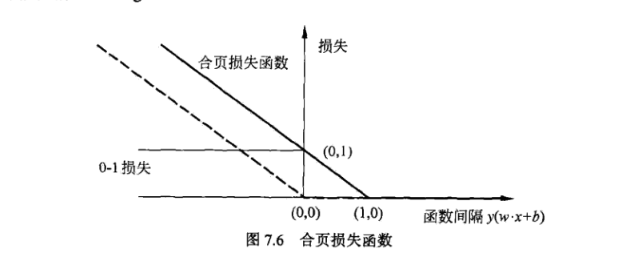

[TOC]

### 交叉熵损失函数

是logSoftmax和NLLLoss两个损失函数结合在一起

其实计算顺序就是softmax-log-NLLLoss，先将得到的数据经过softmax，然后进行log，这时获取的到结果都是负数，那么NLLLoss负责取出对应的维度的结果，并进行取反得到正数。

<a href='https://blog.csdn.net/qq_22210253/article/details/85229988' target='_blank'>参考链接</a>

- 为什么分类问题使用交叉熵损失函数：

似乎是因为使用交叉熵损失函数的时候，其计算出来的loss是一个凸优化问题，而使用梯度下降的时候，凸优化问题有比较好的收敛结果。当使用均方误差计算的时候，loss变成了一个非凸优化问题，这样就很容易陷入局部最优解。

出现的原因是因为使用sigmoid这样的激活函数之后，导致了求导结果出现了y(1-y)这样复杂的结果，导致最终的loss曲线变的比较复杂，如果换成relu，似乎就不存在这个问题了。

但是具体的可能还是需要实验才能确定到底使用哪种损失函数

<a href='https://zhuanlan.zhihu.com/p/53045651' target='_blank'>参考链接</a>

<a href='https://zhuanlan.zhihu.com/p/63731947' target='_blank'>参考链接</a>

<a href='https://blog.csdn.net/qq_22210253/article/details/85229988' target='_blank'>参考链接</a>

### L1损失函数

最小绝对值偏差（LAD）
$L1 = \sum_{i=1}^{n}|Y_i - f(x_i)|$

### L2损失函数

最小平方误差

$L2 = \sum^{n}_{i=1}(Y_i - f(x_i))^2$

### smooth L1损失函数

这是一个分段函数，在[-1, 1]的范围内是L2损失函数，超过这个区间是L1损失函数，好处就是对离群点不那么敏感

$
smooth_{L1}(x) =  
\left\{\begin{matrix}
0.5 x^2 & if \ |x| < 1 \\ 
|x| - 0.5 & else 
\end{matrix}\right.
$

### 均方误差损失函数

MSELoss实际就是对L2进行了一个平均

$MSELoss(x) = \frac{1}{2}\sum^{n}_{i=1}(Y_i - f(x_i))^2$

### KL散度

### 合页损失函数

$
f(x) = \sum^N_{i=1}[1-y_i(w \cdot x_i + b)] + \lambda ||w||^2
$

当样本被正确分类且函数间隔大于1时，合页损失才是0，否则损失是1-y(wx+b)。相比之下，合页损失函数不仅要正确分类，而且确信度足够高时损失才是0。也就是说，合页损失函数对学习有更高的要求。