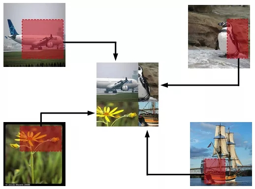
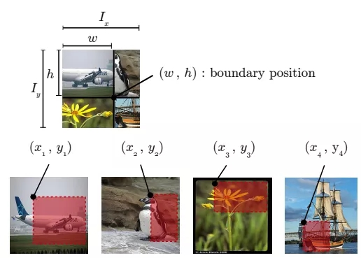
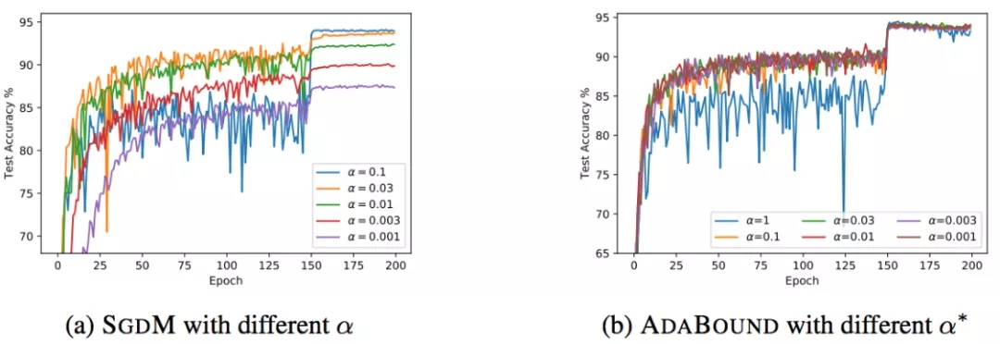

# 图像分类任务中的tricks总结

<a href='https://mp.weixin.qq.com/s/ujr8XubG9jpvM-zOGcZxRw' target='_blank'>参考这里</a>

&emsp;&emsp;计算机视觉主要问题有图像分类、目标检测和图像分割等。针对图像分类任务，提升准确率的方法路线有两条，一个是模型的修改，另一个是各种数据处理和训练的技巧(tricks)。图像分类中的各种技巧对于目标检测、图像分割等任务也有很好的作用，因此值得好好总结。本文在精读论文的基础上，总结了图像分类任务的各种tricks如下：

- Warmup
- Linear scaling learning rate
- Label-smoothing
- Random image cropping and patching
- Knowledge Distillation
- Cutout
- Random erasing
- Cosine learning rate decay
- Mixup training
- AdaBoud
- AutoAugment
- 其他经典的tricks

## Warmup

&emsp;&emsp;学习率是神经网络训练中最重要的超参数之一，针对学习率的技巧有很多。Warm up是在ResNet论文[1]中提到的一种学习率预热的方法。由于刚开始训练时模型的权重(weights)是随机初始化的(全部置为0是一个坑，原因见[2])，此时选择一个较大的学习率，可能会带来模型的不稳定。学习率预热就是在刚开始训练的时候先使用一个较小的学习率，训练一些epoches或iterations，等模型稳定时再修改为预先设置的学习率进行训练。论文[1]中使用一个110层的ResNet在cifar10上训练时，先用0.01的学习率训练直到训练误差低于80%(大概训练了400个iterations)，然后使用0.1的学习率进行训练。

&emsp;&emsp;上述的方法是constant warmup，18年Facebook又针对上面的warmup进行了改进[3]，因为从一个很小的学习率一下变为比较大的学习率可能会导致训练误差突然增大。论文[3]提出了gradual warmup来解决这个问题，即从最开始的小学习率开始，每个iteration增大一点，直到最初设置的比较大的学习率。


## Linear scaling learning rate

&emsp;&emsp;Linear scaling learning rate是在论文[3]中针对比较大的batch size而提出的一种方法。

&emsp;&emsp;在凸优化问题中，随着批量的增加，收敛速度会降低，神经网络也有类似的实证结果。随着batch size的增大，处理相同数据量的速度会越来越快，但是达到相同精度所需要的epoch数量越来越多。也就是说，使用相同的epoch时，大batch size训练的模型与小batch size训练的模型相比，验证准确率会减小。

&emsp;&emsp;上面提到的gradual warmup是解决此问题的方法之一。另外，linear scaling learning rate也是一种有效的方法。在mini-batch SGD训练时，梯度下降的值是随机的，因为每一个batch的数据是随机选择的。增大batch size不会改变梯度的期望，但是会降低它的方差。也就是说，大batch size会降低梯度中的噪声，所以我们可以增大学习率来加快收敛。

&emsp;&emsp;具体做法很简单，比如ResNet原论文[1]中，batch size为256时选择的学习率是0.1，当我们把batch size变为一个较大的数b时，学习率应该变为 0.1 × b/256。

## Label-smoothing

&emsp;&emsp;在分类问题中，我们的最后一层一般是全连接层，然后对应标签的one-hot编码，即把对应类别的值编码为1，其他为0。这种编码方式和通过降低交叉熵损失来调整参数的方式结合起来，会有一些问题。这种方式会鼓励模型对不同类别的输出分数差异非常大，或者说，模型过分相信它的判断。但是，对于一个由多人标注的数据集，不同人标注的准则可能不同，每个人的标注也可能会有一些错误。模型对标签的过分相信会导致过拟合。

&emsp;&emsp;标签平滑(Label-smoothing regularization,LSR)是应对该问题的有效方法之一，它的具体思想是降低我们对于标签的信任，例如我们可以将损失的目标值从1稍微降到0.9，或者将从0稍微升到0.1。标签平滑最早在inception-v2[4]中被提出，它将真实的概率改造为：

$$
q_i = 
\left\{\begin{matrix}
1 - \varepsilon  & if \ i = y \\ 
\varepsilon/(K - 1) & otherwise 
\end{matrix}\right.
$$

&emsp;&emsp;其中，$\varepsilon$是一个小的常数，K是类别的数目，y是图片的真正的标签，i代表第i个类别，q_i是图片为第i类的概率。

&emsp;&emsp;总的来说，LSR是一种通过在标签y中加入噪声，实现对模型约束，降低模型过拟合程度的一种正则化方法。

## Random image cropping and patching

&emsp;&emsp;Random image cropping and patching (RICAP)[7]方法随机裁剪四个图片的中部分，然后把它们拼接为一个图片，同时混合这四个图片的标签。

&emsp;&emsp;RICAP在caifar10上达到了2.19%的错误率。

<div align=center>

<p></p>
</div>

&emsp;&emsp;如下图所示，Ix, Iy是原始图片的宽和高。w和h称为boundary position，它决定了四个裁剪得到的小图片的尺寸。w和h从beta分布Beta(β, β)中随机生成，β也是RICAP的超参数。最终拼接的图片尺寸和原图片尺寸保持一致。

<div align=center>

<p></p>
</div>

<div align=center>

<p></p>
</div>


## Knowledge Distillation

&emsp;&emsp;提高几乎所有机器学习算法性能的一种非常简单的方法是在相同的数据上训练许多不同的模型，然后对它们的预测进行平均。但是使用所有的模型集成进行预测是比较麻烦的，并且可能计算量太大而无法部署到大量用户。Knowledge Distillation(知识蒸馏)[8]方法就是应对这种问题的有效方法之一。

&emsp;&emsp;在知识蒸馏方法中，我们使用一个教师模型来帮助当前的模型（学生模型）训练。教师模型是一个较高准确率的预训练模型，因此学生模型可以在保持模型复杂度不变的情况下提升准确率。比如，可以使用ResNet-152作为教师模型来帮助学生模型ResNet-50训练。在训练过程中，我们会加一个蒸馏损失来惩罚学生模型和教师模型的输出之间的差异。

&emsp;&emsp;给定输入，假定p是真正的概率分布，z和r分别是学生模型和教师模型最后一个全连接层的输出。之前我们会用交叉熵损失l(p,softmax(z))来度量p和z之间的差异，这里的蒸馏损失同样用交叉熵。所以，使用知识蒸馏方法总的损失函数是

$$
l(p, softmax(z)) + T^2 l(softmax(r/T), softmax(z/T))
$$

&emsp;&emsp;上式中，第一项还是原来的损失函数，第二项是添加的用来惩罚学生模型和教师模型输出差异的蒸馏损失。其中，T是一个温度超参数，用来使softmax的输出更加平滑的。实验证明，用ResNet-152作为教师模型来训练ResNet-50，可以提高后者的准确率。


## Cutout

&emsp;&emsp;Cutout[9]是一种新的正则化方法。原理是在训练时随机把图片的一部分减掉，这样能提高模型的鲁棒性。它的来源是计算机视觉任务中经常遇到的物体遮挡问题。通过cutout生成一些类似被遮挡的物体，不仅可以让模型在遇到遮挡问题时表现更好，还能让模型在做决定时更多地考虑环境(context)。

&emsp;&emsp;效果如下图，每个图片的一小部分被cutout了。

<div align=center>

<p></p>
</div>

## Random erasing

&emsp;&emsp;Random erasing[6]其实和cutout非常类似，也是一种模拟物体遮挡情况的数据增强方法。区别在于，cutout是把图片中随机抽中的矩形区域的像素值置为0，相当于裁剪掉，random erasing是用随机数或者数据集中像素的平均值替换原来的像素值。而且，cutout每次裁剪掉的区域大小是固定的，Random erasing替换掉的区域大小是随机的。

<div align=center>

<p></p>
</div>

<div align=center>

<p></p>
</div>

## Cosine learning rate decay

&emsp;&emsp;在warmup之后的训练过程中，学习率不断衰减是一个提高精度的好方法。其中有step decay和cosine decay等，前者是随着epoch增大学习率不断减去一个小的数，后者是让学习率随着训练过程曲线下降。

&emsp;&emsp;对于cosine decay，假设总共有T个batch（不考虑warmup阶段），在第t个batch时，学习率$η_t$为：

$$
\eta = \frac{1}{2} (1 + cos(\frac{t \pi}{T})) \eta
$$

&emsp;&emsp;这里，η代表初始设置的学习率。这种学习率递减的方式称之为cosine decay。

&emsp;&emsp;下面是带有warmup的学习率衰减的可视化图[4]。其中，图(a)是学习率随epoch增大而下降的图，可以看出cosine decay比step decay更加平滑一点。图(b)是准确率随epoch的变化图，两者最终的准确率没有太大差别，不过cosine decay的学习过程更加平滑。

<div align=center>

<p></p>
</div>

&emsp;&emsp;在pytorch的torch.optim.lr_scheduler中有更多的学习率衰减的方法，至于哪个效果好，可能对于不同问题答案是不一样的。

## Mixup training

&emsp;&emsp;Mixup[10]是一种新的数据增强的方法。Mixup training，就是每次取出2张图片，然后将它们线性组合，得到新的图片，以此来作为新的训练样本，进行网络的训练，如下公式，其中x代表图像数据，y代表标签，则得到的新的xhat, yhat。

$$
\begin{aligned}
\hat{x} &= \lambda x_i + (1- \lambda) x_j \\
\hat{y} &= \lambda y_i + (1 - \lambda) y_j 
\end{aligned}
$$

&emsp;&emsp;其中，λ是从Beta(α, α)随机采样的数，在[0,1]之间。在训练过程中，仅使用$(\hat{x}, \hat{y})$。

&emsp;&emsp;Mixup方法主要增强了训练样本之间的线性表达，增强网络的泛化能力，不过mixup方法需要较长的时间才能收敛得比较好。

## AdaBound

&emsp;&emsp;AdaBound是最近一篇论文[5]中提到的，按照作者的说法，AdaBound会让你的训练过程像adam一样快，并且像SGD一样好。

&emsp;&emsp;如下图所示，使用AdaBound会收敛速度更快，过程更平滑，结果更好。

<div align=center>

<p></p>
</div>

&emsp;&emsp;另外，这种方法相对于SGD对超参数的变化不是那么敏感，也就是说鲁棒性更好。但是，针对不同的问题还是需要调节超参数的，只是所用的时间可能变少了。

<div align=center>

<p></p>
</div>

&emsp;&emsp;当然，AdaBound还没有经过普遍的检验，也有可能只是对于某些问题效果好。

&emsp;&emsp;使用方法如下：
&emsp;&emsp;安装AdaBound

```
pip install adabound
```

&emsp;&emsp;使用AdaBound(和其他PyTorch optimizers用法一致)

```
optimizer = adabound.AdaBound(model.parameters(), lr=1e-3, final_lr=0.1)
```

## AutoAugment

&emsp;&emsp;数据增强在图像分类问题上有很重要的作用，但是增强的方法有很多，并非一股脑地用上所有的方法就是最好的。那么，如何选择最佳的数据增强方法呢？ AutoAugment[11]就是一种搜索适合当前问题的数据增强方法的方法。该方法创建一个数据增强策略的搜索空间，利用搜索算法选取适合特定数据集的数据增强策略。此外，从一个数据集中学到的策略能够很好地迁移到其它相似的数据集上。

&emsp;&emsp;AutoAugment在cifar10上的表现如下表，达到了98.52%的准确率。

<div align=center>

<p></p>
</div>


## 其他经典的tricks

### 常用的正则化方法为

- Dropout
- L1/L2正则
- Batch Normalization
- Early stopping
- Random cropping
- Mirroring
- Rotation
- Color shifting
- PCA color augmentation
...

### 其他

- Xavier init[12]
...

## 参考

[1] Deep Residual Learning for Image Recognition(https://arxiv.org/pdf/1512.03385.pdf)

[2] http://cs231n.github.io/neural-networks-2/

[3] Accurate, Large Minibatch SGD:
Training ImageNet in 1 Hour(https://arxiv.org/pdf/1706.02677v2.pdf)

[4] Rethinking the Inception Architecture for Computer Vision(https://arxiv.org/pdf/1512.00567v3.pdf)

[4]Bag of Tricks for Image Classification with Convolutional Neural Networks(https://arxiv.org/pdf/1812.01187.pdf)

[5] Adaptive Gradient Methods with Dynamic Bound of Learning Rate(https://www.luolc.com/publications/adabound/)

[6] Random erasing(https://arxiv.org/pdf/1708.04896v2.pdf)

[7] RICAP(https://arxiv.org/pdf/1811.09030.pdf)

[8] Distilling the Knowledge in a Neural Network(https://arxiv.org/pdf/1503.02531.pdf)

[9] Improved Regularization of Convolutional Neural Networks with Cutout(https://arxiv.org/pdf/1708.04552.pdf)

[10] Mixup: BEYOND EMPIRICAL RISK MINIMIZATION(https://arxiv.org/pdf/1710.09412.pdf)

[11] AutoAugment:
Learning Augmentation Policies from Data(https://arxiv.org/pdf/1805.09501.pdf)

[12] Understanding the difficulty of training deep feedforward neural networks(http://proceedings.mlr.press/v9/glorot10a/glorot10a.pdf)

