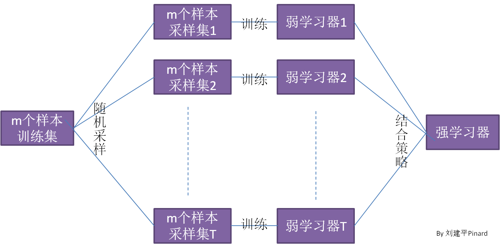
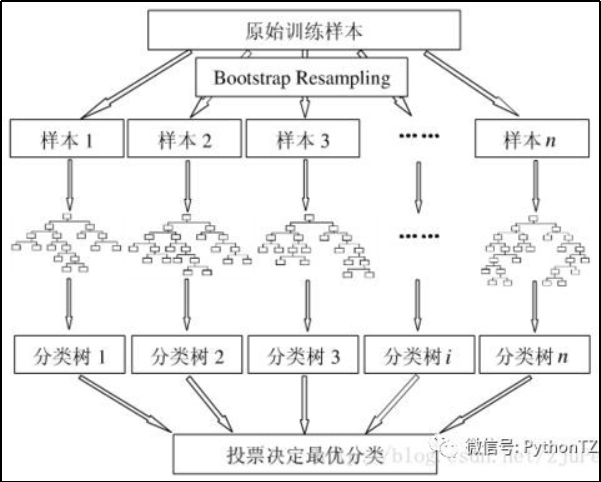
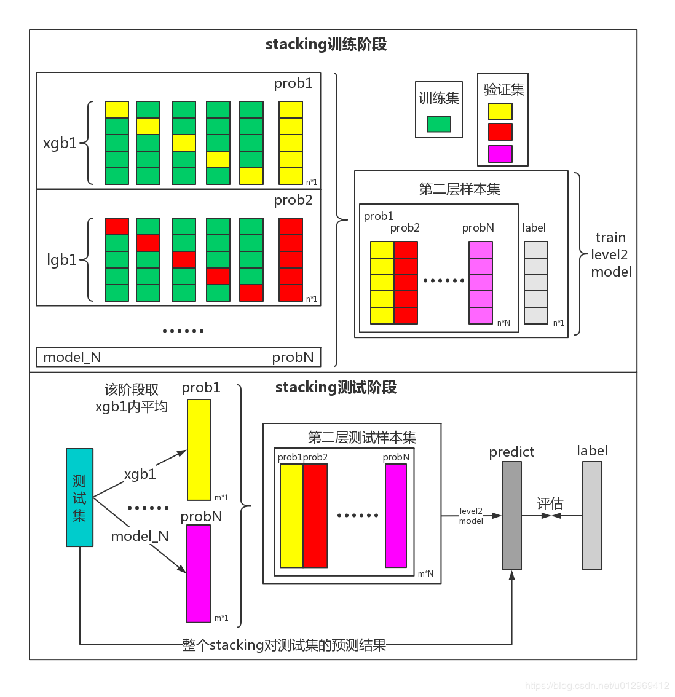
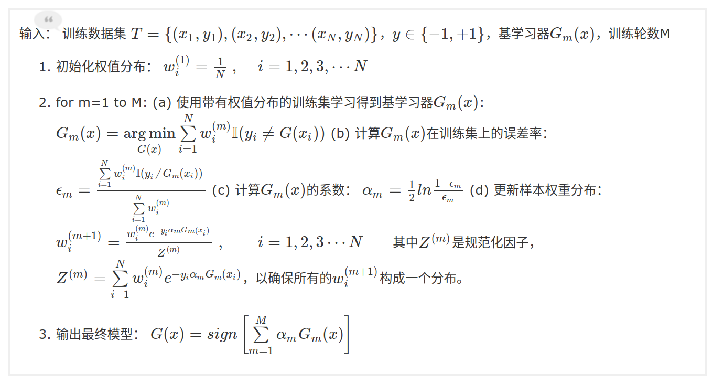
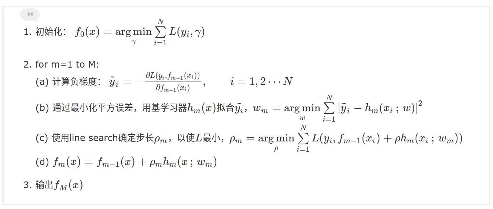

## 1.bagging

&emsp;&emsp;Bagging是Bootstrap Aggregating的英文缩写, 是一种模型融合的框架, 并不是算法. Bagging代表的这一类框架的特点是各个弱学习器之间没有依赖关系，可以并行拟合。如图1-1所示.

图 1-1

&emsp;&emsp;随机采样(bootstrap)就是从我们的训练集里面采集固定个数的样本，但是每采集一个样本后，都将样本放回。也就是说，之前采集到的样本在放回后有可能继续被采集到。对于我们的Bagging算法，一般会随机采集和训练集样本数m一样个数的样本。这样得到的采样集和训练集样本的个数相同，但是样本内容不同。如果我们对有m个样本训练集做T次的随机采样，则由于随机性，T个采样集各不相同。

&emsp;&emsp;因为采用了bootstrap的采样方法, 所以这里涉及到一个袋外数据(Out Of Bag, 简称OOB). 对于一个样本, 假设含有m个数据, 那么每个样本被采集到的概率是 $\frac{1}{m}$, 若果采样了m次都没被采样到的概率是 $(1 - \frac{1}{m})^m$, 假设 $m\rightarrow \infty$, 那么 $lim_{ m\rightarrow \infty }{ (1-\frac { 1 }{ m } ){ }^{ m\ } } $就约等于$ \frac { 1 }{ e } $, 也就是0.368. 所以每个样本都有36.8%左右的概率不被取到, 所以整个训练集中, 每次都会有36.8%的数据不会被取到, 这样的话, 可以取用这36.8%的数据作为开发集验证模型的效果.

&emsp;&emsp;bagging的集合策略也比较简单，对于分类问题，通常使用简单投票法，得到最多票数的类别或者类别之一为最终的模型输出。对于回归问题，通常使用简单平均法，对T个弱学习器得到的回归结果进行算术平均得到最终的模型输出。

&emsp;&emsp;由于Bagging算法每次都进行采样来训练模型，因此泛化能力很强，对于降低模型的方差很有作用。当然对于训练集的拟合程度就会差一些，也就是模型的偏倚会大一些。

### 1.1 Voting

&emsp;&emsp;投票法很简单, 就是少数服从多数的方式, 不过这里有两种选择, 一种是直接获取到多个模型的预测结果, 然后根据预测结果相同多的结果作为最终的预测结果. 另外一种是将模型的输出结果通过softmax获取到预测的概率, 然后可以通过 $y=\underset{i}{max} \sum_{j=1}^{m}w_jp_{ij}$ 来获取到投票结果, 其中 $m$ 是参与投票的模型个数, $w_j$ 是给每个模型的输出结果的权重, $p_{ij}$ 是每个模型预测第j个目标时输出的概率值.

### 1.2 随机森林 Random Forest

&emsp;&emsp; 随机森林RF算是bagging的一种具体实现形式, RF采用了CART决策树作为弱学习器, 然后再进行投票进行最终的模型的融合.

CART决策树可以参考<a href='https://www.cnblogs.com/keye/p/10564914.html' target='_blank'>https://www.cnblogs.com/keye/p/10564914.html</a>

图 1-2

## 2.Stack

&emsp;&emsp;Stacking的思想是一种有层次的融合模型。Stacking工作分为两个阶段。首先，我们使用多个基分类器(Base-leaner)来进行学习。然后将基分类器的输出结果作为下一层分类器（Meta-learner）的输入, 将第二次分类器的输出作为最终的预测结果.

&emsp;&emsp;图2-1 是stack的原理示意图. stack分为两部分, 首先是stack的训练阶段, 之后是stack的预测阶段.

&emsp;&emsp;首先是stack的训练阶段, 图中的xgb1以及lgb1就是基分类器, 一般我们要将训练集进行交叉验证的划分, 然后将每次交叉验证的开发集的预测结果拼接起来, 也就是图中的prob1和prob2, 然后每个模型都会输出一个预测结果, 这样就可以得到多个预测结果了, 将这多个预测结果拼接起来, 就可以当作第二层的训练数据, 然后将训练集的正确label作为第二层的学习目标, 然后就将第一层模型的输出和训练集正确的label作为第二层模型的输入, 这样就可以对第二层的模型进行训练了.

&emsp;&emsp;之后是stack的预测阶段, 首先我们在训练过程中, 得到了多个训练好的模型, 例如图中的xgb1, 因为是通过交叉验证进行的训练, 所以会得到多个训练好的xgb1, 然后我们用着多个xgb1对测试数据集进行预测, 得到的结果进行平均, 然后得到图中的prob1, 因为上面有多个模型, 所以这里会得到多个prob, 然后将pro1, pro2, ..., proN拼接起来, 然后将拼接起来的数据输入到第二层模型中, 然后得到的结果就是最终的预测结果.

图 2-1

&emsp;&emsp;模型的伪算法如下:

Stack的训练伪代码:
（1）在全量训练集N上做k折交叉验证，将得到第一种模型的k个训练模型，k份验证集预测结果将组成全量训练数据的预测结果，N行1列，可用直接预测结果，或归一化后的概率.
（2）将第m种模型做相同操作，再次得到全量训练数据的预测结果，N行1列，…，总共会得到m\*k个已训练模型.
（3）将m种模型的预测结果拼接，得到N行m列的预测结果，作为第一层模型的输出，第二层模型的输入.
（4）利用N行m列的预测结果训练第二层模型.

Stack的预测伪代码:
（1）将测试集输入到m\*k个第一层已训练模型中，得到m\*k个预测结果.
（2）将同类模型的预测结果做平均，最后得到m个预测结果，即N’行m列.
（3）将第一层模型预测输出，输入到第二层模型中，作为最终预测结果.

## 3.Boosting

&emsp;&emsp;原始的Bossting模型集成方式, 是通过在多个弱分类器的基础上层层递进, 通过学习上一个弱分类器的错误输出结果, 来提升整体的模型效果. 原始的Boosting的训练步骤如下:
(1)从训练集D中以无放回的方式抽样随机抽取一个训练子集 $d_1$, 用于弱分类器的 $C_1$ 的训练.
(2)再次从训练集D中以无放回的方式随机抽取一个训练子集 $d_2$, 并将 $C_1$ 中误分类样本的50%加入到训练子集 $d_2$ 中, 然后训练弱分类器 $C_2$.
(3)从训练集D中抽取出来 $C_1$ 和 $C_2$ 分类结果不一致的样本生成训练集 $d_3$, 然后训练弱分类器 $C_3$.
(4)再通过投票来组合三个弱分类器的结果.

&emsp;&emsp;Boosting的改进版本有AdaBoost, Gradient Boosting等.

### 3.1 AdaBoost

参考网址: <a href='https://www.cnblogs.com/massquantity/p/9063033.html' traget='_blank'>https://www.cnblogs.com/massquantity/p/9063033.html</a>

AdaBoost的具体流程如下:

图3-1

### 3.2 Gradient Boosting

参考网址: <a href='https://www.cnblogs.com/massquantity/p/9174746.html' traget='_blank'>https://www.cnblogs.com/massquantity/p/9174746.html</a>

Gradient Boosting的具体流程如下:

图 3-2

